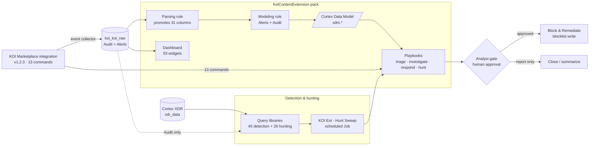

# KOI-MP — Marketplace KOI pack content

This repository is the content, documentation, and evidence base built **against the official
Marketplace KOI pack** — `demisto/content` `Packs/Koi`, **v1.2.3**, 13 commands, integration only.
It adds a companion content pack (parsing/modeling rules, playbooks, a dashboard), four rendered
guides, two XQL query libraries, and read-only tenant scripts — every factual claim traced to a
live-tenant verification record.

> ## ⚠️ There are two packs called KOI — this repo targets only one
>
> A separate in-house **custom pack** (**v1.3.0**, 26 commands, plus playbooks, rules and a
> dashboard) is *also* called **KOI**, *also* has integration id **`KOI`**, is *also* category
> **Endpoint**, and *also* uses `koi-*` commands. **The two cannot coexist on one tenant —
> installing one overwrites the other.**
>
> This repo is built for the **Marketplace** pack (v1.2.3, **13 commands** — a strict subset of the
> custom pack's 26). Anything written for the custom pack that touches `koi-devices-list`,
> `koi-device-inventory-get`, `koi-koidex-risk-report`, `koi-koidex-search`, `koi-remediations-list`,
> `koi-approval-requests-list`, `koi-findings-list`, `koi-users-list`, `koi-groups-list`,
> `koi-runtime-policies-list`, `koi-runtime-policy-get`, `koi-fetch-context-get` or
> `koi-fetch-context-set` **does not work here**. There is no `Koi.Device.*` context prefix either —
> endpoints exist only under `Koi.Inventory.Endpoint.*`, reached *from an item*. The data model is
> **item-centric, not device-centric.** Every document here names the pack and version it describes.
> Keep it that way.

---

## What's inside

| Component | What it is | Link |
|---|---|---|
| **KoiContentExtension pack** | Companion pack (v1.1.0, community). Ships **no integration** — 1 parsing rule + 1 modeling rule over `koi_koi_raw`, 12 playbooks, and a 53-widget dashboard. Install the KOI pack first. | [`Packs/KoiContentExtension/`](Packs/KoiContentExtension/) · [pack README (ops guide)](Packs/KoiContentExtension/README.md) |
| **Customer Guide** | Install and usage guide: configuration, the full 13-command reference, the context model, event collection. | [`docs/KOI_Marketplace_Pack_Customer_Guide_v1.2.3.docx`](docs/KOI_Marketplace_Pack_Customer_Guide_v1.2.3.docx) ([pdf](docs/KOI_Marketplace_Pack_Customer_Guide_v1.2.3.pdf)) |
| **Test Guide** | Executable test steps with expected results, scoped to what this pack can actually do. | [`docs/KOI_Marketplace_Pack_Test_Guide.pptx`](docs/KOI_Marketplace_Pack_Test_Guide.pptx) ([pdf](docs/KOI_Marketplace_Pack_Test_Guide.pdf)) |
| **Troubleshooting Guide** | Pack-specific troubleshooting plus the carried-forward endpoint findings. | [`docs/KOI_Marketplace_Pack_Troubleshooting_Guide_v1.0.docx`](docs/KOI_Marketplace_Pack_Troubleshooting_Guide_v1.0.docx) ([pdf](docs/KOI_Marketplace_Pack_Troubleshooting_Guide_v1.0.pdf)) |
| **Overview deck** | Short overview presentation. | [`docs/KOI_Marketplace_Pack_Overview.pptx`](docs/KOI_Marketplace_Pack_Overview.pptx) ([pdf](docs/KOI_Marketplace_Pack_Overview.pdf)) |
| **Detection queries** | 45 validated XQL detection/investigation queries — `koi_koi_raw` × `xdr_data`. | [`docs/DETECTION_QUERIES.md`](docs/DETECTION_QUERIES.md) |
| **Hunting queries** | 26 proactive, hypothesis-driven hunting queries across the agentic supply chain and runtime. | [`docs/HUNTING_QUERIES.md`](docs/HUNTING_QUERIES.md) |
| **XQL bodies** | The raw `.xql` query bodies backing the two libraries. | [`docs/xql/`](docs/xql/) |
| **Scripts** | Read-only tenant clients and the doc-generation builders. Never write to the tenant. | [`scripts/`](scripts/) |
| **Evidence** | Structural command-sweep and probe results (raw captures are git-ignored). | [`evidence/`](evidence/) |
| **Reference** | The pinned upstream `Koi.yml` (md5-checked) + the derived 13-command surface JSON. | [`reference/`](reference/) |
| **VERIFIED_FACTS** | **The source of truth.** Everything verified on the live tenant, dated, with `[YAML]` / `[LIVE]` / `[UNVERIFIED]` tags. | [`VERIFIED_FACTS.md`](VERIFIED_FACTS.md) |
| **Session brief** | The original pack comparison, command gap, and order of work. | [`SESSION_BRIEF.md`](SESSION_BRIEF.md) |

---

## Architecture

How the pieces fit: the installed KOI integration produces one dataset; the companion pack
normalizes and models it, then drives the playbooks and dashboard; a parallel Cortex XDR lane feeds
the query libraries and the scheduled hunt sweep. Response is always **analyst-gated**, never
automatic.



The [companion pack README](Packs/KoiContentExtension/README.md) details this architecture and every
operational caveat behind it.

---

## Quick start

- **Read the guides.** Start with the [Customer Guide](docs/KOI_Marketplace_Pack_Customer_Guide_v1.2.3.pdf)
  for install and the 13-command reference; the [Overview deck](docs/KOI_Marketplace_Pack_Overview.pdf)
  is the two-minute version. The `.docx`/`.pptx` sources sit beside each `.pdf` in [`docs/`](docs/).
- **Install the companion pack.** Install and configure the **KOI** pack (v1.2.3+) *first*, then
  install `KoiContentExtension`. Full prerequisites, minimum server version (XSIAM 8.4.0), and the
  operational caveats are in the [pack README / ops guide](Packs/KoiContentExtension/README.md).
- **Run a query from the library.** Pick a query from
  [`DETECTION_QUERIES.md`](docs/DETECTION_QUERIES.md) or
  [`HUNTING_QUERIES.md`](docs/HUNTING_QUERIES.md), paste it into the XQL search on your tenant, or
  drive it through `xdr-xql-generic-query`. Raw bodies are in [`docs/xql/`](docs/xql/). Mind the
  standing rules at the top of each library (Alert dedupe, marketplace vocabulary).
- **Use the read-only scripts.** Put credentials in a git-ignored `.env` (the scripts load it in
  Python — **do not `source .env` in zsh**). `scripts/koi_tenant.py` talks Cortex XSIAM/XQL,
  `scripts/koi_api.py` talks the KOI vendor API, `scripts/sweep_commands.py` sweeps the read-only
  command surface. They never write to the tenant.

---

## Key facts to know before you use any of it

Each of these is verified on the live tenant and recorded in [`VERIFIED_FACTS.md`](VERIFIED_FACTS.md)
— cite from there, and carry the `2026-07-21` date on every live figure.

- **Alerts are duplicated ~245×/24h — always dedupe.** The integration re-sends every still-open
  alert on each 1-minute fetch, so a plain `count()` over `source_log_type = "Alerts"` is wrong by
  two orders of magnitude. Dedupe on `json_extract_scalar(metadata, "$.notification_event_id")`.
  **Audit is not duplicated (1.0).** See [VERIFIED_FACTS §7e](VERIFIED_FACTS.md).
- **The event and API marketplace vocabularies differ.** Events use short forms
  (`software_windows`, `chrome`, `vsc`); the API/commands want long forms (`windows`,
  `chrome_web_store`, `vscode`). Only `npm`/`pypi` match. Passing an event value to a command
  returns HTTP 400. See [VERIFIED_FACTS §7c](VERIFIED_FACTS.md).
- **KOI is run-on-demand on Windows.** There is no resident agent — a scan must run for events to
  appear. See [VERIFIED_FACTS §7b](VERIFIED_FACTS.md).
- **Rules apply at ingest only.** Historical `koi_koi_raw` rows are never reprocessed; promoted
  columns stay null on old data, and the parsing rule and modeling rule must deploy together. The
  pack ships **no integration by design** (a second `KOI` integration id would collide). See
  [VERIFIED_FACTS §4](VERIFIED_FACTS.md) and the companion pack README caveats 1–2.
- **KOI × XDR correlation.** KOI says *what* is installed; Cortex XDR (`xdr_data`) says how it got
  there and whether it ran. That correlation is the whole point of the query libraries and the hunt
  sweep. See [VERIFIED_FACTS §7d](VERIFIED_FACTS.md).

---

## Repository layout

```
KOI-MP/
├── README.md                       this file — the repo map
├── CLAUDE.md                       project instructions
├── SESSION_BRIEF.md                pack comparison, command gap, order of work
├── VERIFIED_FACTS.md               the evidence base — source of truth
├── REFERENCE_custom-pack-playbooks.md   custom-pack context (reference only)
├── Packs/
│   └── KoiContentExtension/        companion pack: rules, 12 playbooks, dashboard
│       ├── ParsingRules/ ModelingRules/  koi_koi_raw normalization + XDM model
│       ├── Playbooks/              triage · investigate · respond · hunt · script-runner
│       ├── XSIAMDashboards/        53-widget Alerts dashboard
│       └── README.md               ops guide: prerequisites + operational caveats
├── docs/
│   ├── *.docx / *.pptx / *.pdf     the four rendered guides
│   ├── build_*.js                  Node generators that build the guides
│   ├── DETECTION_QUERIES.md        45 detection/investigation XQL queries
│   ├── HUNTING_QUERIES.md          26 hunting XQL queries
│   └── xql/                        raw .xql query bodies
├── reference/
│   ├── marketplace-Koi.yml         pinned upstream Koi.yml (md5-checked)
│   └── marketplace-pack.json       derived 13-command surface
├── scripts/                        read-only tenant clients + doc builders
└── evidence/
    ├── command-sweep.json          structural command-sweep results
    ├── followup-probes.json        follow-up probe results
    └── raw/                        ⚠️ git-ignored — live captures with real hostnames
```

`evidence/raw/` is excluded from git: live captures carry real tenant hostnames and installed-software
inventory. Credentials live in a git-ignored `.env` and are never committed.
