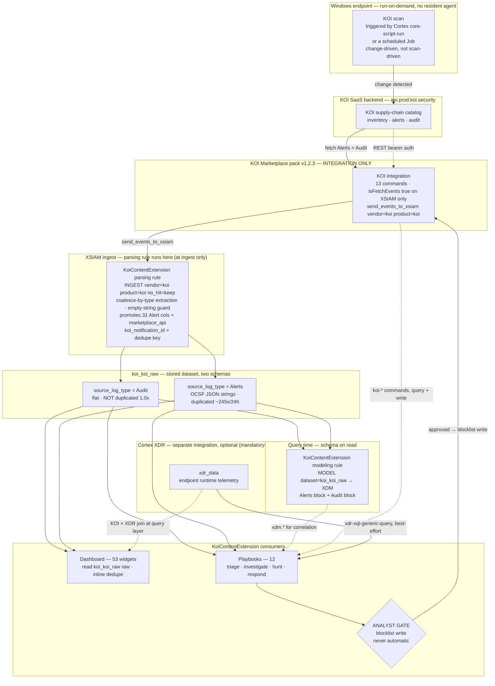

# Solution architecture — KOI supply-chain content on Cortex XSIAM

**Scope.** This document explains how the whole KOI content solution fits together and *why* it is
built the way it is. It covers two packs that work as a pair:

- the official **Marketplace KOI pack** from `demisto/content` (`Packs/Koi`, **v1.2.3** — 13
  commands, integration only), and
- the companion **KoiContentExtension pack** (**v1.1.0**, community support) built in this
  repository, which ships the rules, dashboard and playbooks the Marketplace pack does not.

> ⚠️ **Which KOI pack.** A separate in-house **custom** KOI pack (v1.3.0, 26 commands, with its own
> rules/dashboard/playbooks) is also called KOI, also has integration id `KOI`, also is category
> `Endpoint`, and also uses `koi-*` commands. The two Marketplace and custom packs **cannot coexist
> on one tenant** — installing one overwrites the other. Everything below concerns the **Marketplace
> pack v1.2.3** and the extension built on top of it, never the custom pack. See
> [`../SESSION_BRIEF.md`](../SESSION_BRIEF.md) for the full trap.

Every factual claim here traces to [`../VERIFIED_FACTS.md`](../VERIFIED_FACTS.md) (the live-tenant
evidence base, verified on `api-ayman.xdr.eu` 20–22 July 2026), to the derived
[`../reference/marketplace-pack.json`](../reference/marketplace-pack.json) (the 13-command surface,
built from the md5-pinned upstream `Koi.yml`), or to the pack content on disk. Live figures carry
their measurement date because the dataset grows on every fetch cycle.

---

## 1. The problem

The Marketplace KOI pack is **integration-only**. It ships 13 commands and an event collector, and
**nothing else** — no parsing rule, no modeling rule, no dashboard, no playbooks
([`../VERIFIED_FACTS.md`](../VERIFIED_FACTS.md) §4, §7e; `SESSION_BRIEF.md` §2). That leaves four
gaps that any real deployment has to close, and one hard constraint that shapes how they can be
closed.

**1. `koi_koi_raw` arrives unnormalised.** The integration calls
`send_events_to_xsiam(vendor="koi", product="koi")`, so events land in the dataset **`koi_koi_raw`**
(live-confirmed, no longer inferred — §1, §3). But with no parsing or modeling rule shipped,
**no XDM field is populated at all** (§3.2). Worse, the dataset holds *two incompatible schemas*
discriminated by `source_log_type`: `Audit` rows are flat and KOI-native; `Alerts` rows are OCSF,
and their `resources` / `observables` / `metadata` are JSON **strings**, not objects, so a query
that treats them as structured fields silently returns nothing (§3.1). The interesting fields are
buried inside those blobs.

**2. The Alerts stream is massively duplicated.** The integration re-sends every still-open alert on
every 1-minute fetch cycle, so `koi_koi_raw` holds one row **per alert per fetch** — measured at
**~245× inflation over 24 hours** (734 rows for 3 real alerts) and ~3.3× over 90 days (§7e).
Audit is unaffected (1.0×). Any `count()` over Alerts is wrong by two orders of magnitude. There is
no shipped column to dedupe on.

**3. The event vocabulary and the API vocabulary disagree.** The `marketplace` value in an event
uses **short forms** (`software_windows`, `chrome`, `vsc`); the API and the command arguments use
**long forms** (`windows`, `chrome_web_store`, `vscode`). Only `npm` and `pypi` match. Passing an
event value straight to a command returns **HTTP 400** — and this bites the most common value in the
whole dataset (§7c, §7d.1).

**4. The data model is item-centric, and thinner than the custom pack's.** There is **no
`Koi.Device.*` context prefix** — `grep -c 'Koi\.Device\.'` returns 0 in the YAML, the Python and
the README (§4). Endpoints are reachable only *from an item*, via `Koi.Inventory.Endpoint.*`. And 13
of the custom pack's 26 commands simply do not exist here (no `koi-koidex-risk-report`, no
`koi-remediations-list`, no `koi-devices-list`, …), so catalog risk, remediation history, device
listing and fetch-state diagnostics have no entry point (`SESSION_BRIEF.md` §3;
[`../Packs/KoiContentExtension/README.md`](../Packs/KoiContentExtension/README.md) §5).

**The hard constraint — the two-pack collision.** Both KOI packs declare the same pack name, the
same `commonfields.id: KOI`, the same integration name and the same category. Whatever closes these
gaps **cannot ship its own KOI integration**, because that integration would collide on
`commonfields.id: KOI` and silently overwrite the installed one (`SESSION_BRIEF.md` §2.1;
extension `README.md`, "Prerequisite"). This single fact dictates the shape of the entire solution:
the extension is *additive content that binds to a stream it does not own*.

---

## 2. The layers

The solution is a pipeline. The Marketplace pack supplies the collector and the commands; the
KoiContentExtension pack supplies everything that turns raw events into an operational picture;
Cortex XDR contributes an optional runtime-telemetry lane that joins at the query and playbook layer.

| Layer | Owner | What it does |
|---|---|---|
| **Collection** | KOI integration (Marketplace pack) | Run-on-demand scan on Windows; fetch `Alerts` + `Audit`; 13 commands over `/api/external/v2` |
| **Raw storage** | `koi_koi_raw` dataset | Two schemas split by `source_log_type`: flat Audit, OCSF Alerts |
| **Normalisation (at ingest)** | KoiContentExtension **parsing rule** | Promotes 31 flat Alert columns + `marketplace_api` on Audit out of the JSON blobs; adds the dedupe key |
| **Modelling (at read)** | KoiContentExtension **modeling rule** | Maps the promoted + raw columns to the Cortex Data Model (XDM), Alerts and Audit blocks |
| **Consumption** | Dashboard (53 widgets) + 12 playbooks | Triage, investigation, hunting, analyst-gated response, and a monitoring dashboard |
| **Correlation (optional)** | Cortex XDR `xdr_data` | Best-effort endpoint-runtime enrichment joined at the query/playbook layer |

### Architecture data-flow diagram

**Reading the diagram.** Events flow top to bottom: a change on an endpoint surfaces in the KOI
backend, the integration fetches it, the **parsing rule promotes columns at ingest**, and the row is
stored in `koi_koi_raw`. From there the **modeling rule maps to XDM at read time** (schema-on-read),
while the dashboard and playbooks also read the raw dataset directly. The **Cortex XDR lane** is a
dotted, optional join: it never sits in the ingest path and never feeds the analyst gate. The
**analyst gate** is a hard decision node — a blocklist write is only ever reached through human
approval, never by an automatic edge.

Two ordering subtleties the diagram encodes deliberately:

- **The parsing rule is drawn *before* the stored dataset, not after it.** Parsing rules apply at
  ingest; the promoted columns become part of the stored row. This is why the flow is
  integration → parsing → `koi_koi_raw`, and why historical rows can never be back-filled (§3, and
  design decision 2 below).
- **The modeling rule is drawn as query-time.** XDM fields do not exist on disk; they are computed
  when a consumer reads `koi_koi_raw`. The dashboard deliberately does **not** depend on them (it
  reads raw), which is why a broken modeling rule cannot blank the dashboard.

---

## 3. The design decisions, with rationale

This is the load-bearing part. Each decision is a response to a verified fact, not a preference.

### 3.1 Ship NO integration

**Decision.** The KoiContentExtension pack ships no integration, adds no command, and creates no
dataset. It binds to the KOI event stream by the `(vendor, product)` pair in its parsing-rule
`[INGEST:]` header and to the dataset by name in the modeling rule's `[MODEL:]` header.

**Rationale.** The two KOI packs share `commonfields.id: KOI`. An integration in the extension pack
would collide on that id and overwrite the installed KOI integration — the exact failure the whole
project exists to avoid. Binding by stream instead of by pack sidesteps the collision entirely: the
Marketplace integration keeps calling `send_events_to_xsiam(vendor="koi", product="koi")`, and the
parsing rule attaches to that stream with no change to the integration
([parsing-rule README](../Packs/KoiContentExtension/ParsingRules/KoiContentExtension/README.md)).

**Consequence, stated honestly.** Because binding is by stream and dataset — not by pack — **no
rename prevents a future collision.** If Palo Alto Networks later adds parsing or modeling rules to
`Packs/Koi`, both packs will contend for the same `(koi, koi)` ingest binding and the same
`koi_koi_raw` model. There is no namespacing mechanism that avoids this; before upgrading the KOI
pack, check its release notes for new `ParsingRules/` or `ModelingRules/` content (extension
`README.md`, caveat 3).

### 3.2 Rules apply at ingest only; parsing and modeling deploy together

**Decision.** The parsing and modeling rules are a matched pair that must be installed together, and
consumers are engineered not to depend on either being present retroactively.

**Rationale — at-ingest.** XSIAM evaluates parsing rules **as events arrive**. Rows already in
`koi_koi_raw` are never reprocessed, so every promoted column is **permanently null on all
historical data** — roughly 21,200 rows on the validation tenant (§3;
[parsing-rule README](../Packs/KoiContentExtension/ParsingRules/KoiContentExtension/README.md),
"Parsing applies AT INGEST ONLY"). After deployment you must fetch fresh events before anything
appears; an empty promoted column immediately after install is expected, not a broken rule.

**Rationale — deploy together.** The modeling rule does not re-walk the JSON. Its Alerts block reads
nine flat columns the parsing rule created, and its Audit block reads one (`marketplace_api`).
Deployed without the parsing rule, **12 of the 20 Alerts mappings silently resolve to null** — the
whole host block, the whole resource block, `xdm.event.type`, `xdm.alert.name`,
`xdm.source.user.username` (extension `README.md`, caveat 2; modeling-rule header). It does not
error; it maps nulls. The most deceptive failure is `xdm.target.host.os_family`, which falls through
to an explicit `to_string(null)` default and *looks like* a deliberate "unknown".

**How consumers are protected.** The dashboard is built to survive both facts. Of its 53 widgets,
25 never reference a promoted column and the other 28 re-derive every promoted column inline from the
raw `resources` / `observables` / `metadata` JSON (`alter <col> = coalesce(<promoted>, <guarded raw
read>)`). **Zero widgets depend on a promoted column with no inline fallback**, so all 53 render
against historical rows and keep working after the rule lands. The same applies to dedupe: 42 widgets
read `notification_event_id` inline rather than the promoted `koi_notification_id` (extension
`README.md`, caveat 1).

### 3.3 Alert de-duplication on `notification_event_id`

**Decision.** The parsing rule promotes **`koi_notification_id`** from
`metadata.notification_event_id`, and every consumer that counts alerts uses
`count_distinct(koi_notification_id)` — never `count()`.

**Rationale.** The integration re-sends every still-open alert each fetch cycle, so a row is a fetch,
not an alert (§7e). Of four candidate identifiers measured over the same 90-day window:

| Field | Distinct / 1,048 rows | Identifies |
|---|---|---|
| `_id` | 1,048 | the **row** — counts every duplicate |
| `koi_notification_id` (`metadata.notification_event_id`) | **317** | the **alert occurrence** ✅ |
| `koi_event_id` (`observables[event.id]`) | 20 | the **scan batch** — too coarse |
| `finding_uid` (`finding_info.uid`) | 3 | the **finding/policy definition** — not an identity |

`notification_event_id` is a verified 1:1 identity for the tuple
`(item.id, device.id, finding_info.uid, finding_info.created_time)` — 317 ids, 317 tuples, zero
collisions (§7e.2). The hierarchy is *scan batch (20) ⊃ notification (317) ⊃ rows (1,048)*, and the
notification level is the one the pack previously had no column for.

**Two related choices fall out of this:**

- **XDM cannot express deduplication.** There is no "this row is a duplicate" field, so the fix
  cannot live in the modeling rule — every consumer has to dedupe at query time (modeling-rule
  header; parsing-rule README). `koi_notification_id` is therefore deliberately *not* in the
  parsing→modeling dependency list; it stays a queryable raw column.
- **On historical rows the promoted column is null** (decision 3.2), so dedupe over old data must use
  `json_extract_scalar(metadata, "$.notification_event_id")` inline — which is exactly what the
  dashboard widgets and the hunting queries do (§7e.4;
  [`DETECTION_QUERIES.md`](./DETECTION_QUERIES.md), [`HUNTING_QUERIES.md`](./HUNTING_QUERIES.md)).

### 3.4 Marketplace vocabulary mapping (event short-forms → API long-forms)

**Decision.** The parsing rule promotes **both** vocabularies and never conflates them:
`item_marketplace` / `marketplace` keep the verbatim short event form (for display and matching
other event data); `item_marketplace_api` (Alerts) and `marketplace_api` (Audit) carry the API long
form, produced by a 22-value mapping table taken from the `marketplace` argument's `predefined` list
in `Koi.yml` v1.2.3 (verified against
[`../reference/marketplace-pack.json`](../reference/marketplace-pack.json), not typed from memory).

**Rationale.** The event vocabulary and the API vocabulary are different; only `npm` and `pypi`
match. Passing a short form to a command returns HTTP 400 (§7c). This is not defensive polish — in
the operator-driven test, the mapping was **necessary for 16 of 19 events (84%)**; only `pypi` would
have worked untouched (§7d.1). And an audit-driven flow breaks on the single most common value in the
whole dataset (`software_windows`, ~5,300 events → `windows`).

**Why the mapping is trustworthy, not guesswork.** The alert payload carries the field *twice* in two
vocabularies: the observable `item.marketplace` is the short form while the item resource's
`data.marketplace` is already the API form. On live rows the two agree with the mapping table on
296 of 296 extension rows — Koi itself states `chrome` → `chrome_web_store` in its own payload
(parsing-rule README, "The two marketplace vocabularies").

**Three values map to NULL on purpose.** `built_in` and `side_loaded` are `installation_method`
values *leaking into* the `marketplace` field, and `ollama` is absent from the API's list entirely. A
null `*_api` column means "unknown marketplace — cannot call an item-scoped command", **not** "fall
back to the raw value". The mapping is idempotent (an already-long value passes through unchanged),
so the same expression is safe to point at either vocabulary. Both the modeling rule
(`xdm.target.resource.sub_type` on both blocks) and four playbooks apply the same table, so a
raw-driven flow — including audit-driven — is safe end to end (extension `README.md`, caveat 7).

### 3.5 Field-level capability discipline

**Decision.** Content depends only on fields the integration **actually populates**, tested at the
value level (`x != null AND x != ""`), not merely at the "does the command exist" level. Two
mappings that looked correct were **removed** after live measurement, and each carries a
DO-NOT-RE-ADD comment at its site in the [modeling
rule](../Packs/KoiContentExtension/ModelingRules/KoiContentExtension/KoiContentExtension.xif).

**Rationale — the two removed mappings (§7e.3, §7f.2, §7f.4):**

| Removed | Was mapped to | Why removed |
|---|---|---|
| `xdm.alert.original_alert_id` | `finding_uid` | `finding_uid` is a **policy-definition** id — 3 distinct values across ~1,040 alerts (`20940 "MCP Servers alerts"`, `23300 "NPM Block CS"`, `20907 "yito test"`). Mapping it would collapse ~1,040 alerts onto 3 in any cross-source join. Koi supplies no per-alert vendor identifier on this stream, so the field is left **empty on purpose** |
| `xdm.target.host.fqdn` | `alert_hostname` | Hostnames contain a dot on **0 of 1,138 rows** (`M-HFQQ44F5XF`, `Gary的MacBook Air`) — they are bare names. A bare name in `fqdn` silently mismatches a real FQDN from another source. `xdm.target.host.hostname` already carries it correctly |

The principle: *an empty field is a true statement; a populated field that is wrong is a silent
cross-source join failure.* The same discipline rejected `_id` and `koi_notification_id` as
substitutes for `original_alert_id` (a row id and a delivery id, neither a vendor alert id).

**Rationale — the empty-string guard (§7f.1).** MCP alerts send the observable
`{"name":"item.version","value":""}` — the key is present, so `alert_item_version != null` passes on
100% of rows while ~73% hold nothing (831 of 842 MCP rows). This is the **only** field in the pack
where a bare null-check gives a false pass; every other promoted column was re-tested for empty
strings and came back clean. `alert_item_version` is therefore re-guarded in a later `alter` stage
(`if(alert_item_version != "", …, to_string(null))`), taking the true populated count from a
misleading 1,048 to 307. Any population audit on this feed must test both conditions.

**Rationale — kept-but-currently-null mappings (§7f.3).** The alert population has shifted:
`extension` alerts stopped arriving on 2026-07-09, and `mcp_server` alerts now dominate. So
`item_marketplace`, `item_package_name`, `item_risk_level` and `xdm.target.resource.sub_type` are
null on *current* data. These are **not** broken mappings — the cohort that populates them has
stopped, and may return the moment an extension policy fires again. They are kept deliberately; do
not delete them on the evidence of a 24-hour query. The `resources[mcp].data.marketplace` field is
*not* an acceptable substitute — it is the empty string on ~99% of the MCP cohort and would need its
own empty-string guard.

### 3.6 Optional Cortex XDR / XQL enrichment (graceful degradation)

**Decision.** The `CortexXDR` pack is declared `mandatory: false` in `pack_metadata.json`. Three
investigation playbooks and the hunt sweep carry a best-effort XDR-correlation lane; every XQL task
is `continueonerror` and every lane is parallel, never in the critical path.

**Rationale — why optional.** The pack's governing rule is *stay within what the KOI Marketplace
integration supplies.* The XDR lane deliberately steps outside that, introducing a dependency on the
Cortex XDR - XQL Query Engine — an integration that is **not** KOI and **not** part of this pack.
That is acceptable only because it uses genuine platform telemetry (`xdr_data`) rather than a
fabricated KOI capability, and because it is engineered to disappear cleanly when the engine is
absent: the pack installs and every KOI-command playbook works with no XQL engine present
(extension `README.md`, "Optional — Cortex XDR × KOI correlation enrichment").

**Rationale — graceful degradation.** XQL can be slow, rate-limited, or the engine can be absent.
Each enrichment is a separate lane branched off the existing flow; it does not feed the verdict, the
analyst gate, or the auto-close. When it errors, the war-room note states plainly that the enrichment
degraded — so a blank is never mistaken for "nothing found". `KOI Ext - Hunt Sweep` is the one
playbook whose whole purpose is running XQL, so in practice it needs the engine — but even it fails
gracefully, posting *"XQL engine unavailable — hunt sweep skipped"* rather than erroring. The
`CortexXDR` dependency stays optional so the pack never forces an install.

---

## 4. The KOI × XDR correlation model

This is the conceptual core of the solution, and the reason the optional XDR lane earns its
complexity.

**The two sources answer different questions.**

- **KOI** is a **supply-chain inventory and alert** source: *what exists in the estate and what is
  risky* — every installed package, extension, MCP server, model and repository, plus policy-driven
  alerts on the risky ones. It is run-on-demand and change-driven (§7b, §7d): it sees state changes
  in user-profile paths.
- **Cortex XDR** (`xdr_data`) is an **endpoint-runtime** source: *how something arrived and whether
  it ran* — process executions, file writes, module loads, network egress, and the parent/user
  chain behind each.

**The value is the join.** KOI tells you *what is installed and whether it is dangerous*; XDR tells
you *whether that dangerous thing actually executed and how it got there*. Neither answers the other's
question. Notably, KOI's own scan is itself visible in `xdr_data`, which is what makes the two
correlatable on host and time. Three concrete joins the content implements:

**Example 1 — a KOI-risky item observed executing.** KOI raises an alert (or carries an inventory
record) that item *X* is high-risk or known-bad — e.g. an npm package caught by the `NPM Block CS`
policy. On its own that is a posture finding. `KOI Ext - Investigate Item` runs the Theme-D/**D2**
XQL keyed on `Inv.item_id` fleet-wide, asking whether anything from that item's install path
actually executed, loaded, or was written to disk in `xdr_data`. A risky item that never ran is a
lower priority than the same item observed executing — a distinction KOI cannot make alone
(extension `README.md`, optional-enrichment table).

**Example 2 — a shadow MCP server.** KOI inventories MCP servers, but a bare config-only declaration
did **not** register within 40 minutes when no recognised client was installed (§7d.2c — qualified).
The `KOI Ext - Hunt Sweep` **H4.2** hunt inverts the question: it looks for **shadow agentic
software** — MCP or AI-agent processes *executing in `xdr_data`* that KOI never inventoried. A hit is
an agentic runtime KOI's supply-chain view is blind to. The join is the whole detection: KOI's
inventory is the allow-set, XDR's runtime is the observed-set, and the gap between them is the lead
([`HUNTING_QUERIES.md`](./HUNTING_QUERIES.md), H4.2).

**Example 3 — an AI agent (or any process) installing software.** KOI detects the *what*: a
`git clone` of `octocat/Hello-World` is inventoried as a first-class item with the **remote identity
as the name and the commit SHA as the version** (§7d.2a), and a `pip install --user` lands as a
`pypi` install event (§7d.2). But KOI detects on the **install path**, not the installing process —
it scans user-profile locations and ignores the SYSTEM profile, and the identity of the installing
process is irrelevant to it (§7d.2). XDR supplies exactly that missing dimension: the Theme-A
acquisition-provenance queries correlate KOI's install event with the `xdr_data` process, parent and
user that performed it — which agent, which shell, which account pulled the code. KOI says *a repo at
this SHA appeared*; XDR says *`git.exe`, spawned by this parent, run by this user, put it there*
([`DETECTION_QUERIES.md`](./DETECTION_QUERIES.md), Theme A).

**Why the join is engineered conservatively.** Every correlation query reads `xdr_data` and
`koi_koi_raw source_log_type = "Audit"` (or dedupes Alerts inline) — none counts raw Alert rows, so
the ~245× duplication never contaminates a correlation. And the cross-source key is chosen with the
same field-level discipline as §3.5: joins use `hostname` (which the data satisfies) and `item_id`,
never `fqdn` (which it does not).

---

## 5. What is verified vs assumed

The evidence base for every claim in this document is
[`../VERIFIED_FACTS.md`](../VERIFIED_FACTS.md), where each fact is tagged **[LIVE]** (observed on
tenant `api-ayman.xdr.eu` or the KOI API, 20–22 July 2026), **[YAML]** (derived from the md5-pinned
`Koi.yml` via [`../reference/marketplace-pack.json`](../reference/marketplace-pack.json)), or
**[UNVERIFIED]** (stated as such, never asserted). What follows is the honest boundary of that base.

**Verified live.** The dataset name `koi_koi_raw`; the Audit/Alerts split and their schemas; the
~245× Alerts duplication and the `notification_event_id` dedupe identity; the marketplace-vocabulary
divergence and the necessity of the mapping (proven on data we caused, §7d.1); the empty-string
defeat of null-checks and the removed `original_alert_id` / `fqdn` mappings (§7e, §7f); the
run-on-demand, change-driven, user-profile-path detection behaviour and the full install→uninstall
lifecycle (§7b, §7d); and the API behaviour behind **8 of the 13 commands**, exercised read-only.

**The one structural gap — commands could not be executed through XSIAM (§6).** On this tenant the
XSOAR-API path that `demisto-sdk run` and the war-room use is broken: `POST /investigations/search`
303-redirects to `/#/404`, `POST /incident` returns an empty body, and an API-key user's auto-created
playground panics on every command including the built-in `!Print`. Command behaviour was therefore
verified **one layer down** — against the same endpoints, with the same bearer auth and the same API
keys the two instances use. That establishes the endpoints exist, the parameters are accepted or
rejected as described, and the response shapes are as recorded. It does **not** establish the
XSOAR-side context mapping and human-readable output, which are asserted from the YAML and `Koi.py`
and tagged **[YAML]** wherever used. To close this gap, run the command sweep from the XSIAM UI war
room and compare against `evidence/command-sweep.json`.

**Deliberately not exercised.** The **5 state-changing commands** (`koi-policy-status-update` and the
allowlist/blocklist add/remove pairs) were never run, because each mutates tenant state — and note
the pack flags only 2 of the 5 with `execution: true` (§1.1). `koi-get-events` with
`should_push_events=true` is likewise not safely repeatable despite being a GET.

**Qualified / time-sensitive findings.** Three findings are true as measured but must be re-checked
before being leaned on: (a) **tenant attribution stopped populating** — `koi_tenant_name` /
`koi_customer_id` are null on all recent ingestion, which is why the modeling rule falls back to
`_collector_name` (§7b.1, §7d.4); (b) the **MCP config-only non-registration** is a single
qualified observation, not proof that KOI ignores MCP configs generally (§7d.2c); (c) all
**live counts drift** with ingestion and are only meaningful as shapes and ratios — never quote an
absolute row count as an expected result (§7).

**Inherited, not re-verified.** The endpoint-forensics facts in
[`../VERIFIED_FACTS.md`](../VERIFIED_FACTS.md) §8 (the `C:\ProgramData\Koi\` file map, the mtime
freshness proof, the two-registry-hive requirement, KOI's bundled Python) are carried forward from
the custom-pack investigation and are marked inherited wherever used.

---

## See also

- [`../VERIFIED_FACTS.md`](../VERIFIED_FACTS.md) — the evidence base (every claim here traces to it)
- [`../README.md`](../README.md) — repository overview and how the docs are kept honest
- [`../SESSION_BRIEF.md`](../SESSION_BRIEF.md) — the two-pack comparison and the collision trap
- [`../Packs/KoiContentExtension/README.md`](../Packs/KoiContentExtension/README.md) — the extension pack: caveats, playbooks, dependencies
- [parsing-rule README](../Packs/KoiContentExtension/ParsingRules/KoiContentExtension/README.md) · [parsing rule `.xif`](../Packs/KoiContentExtension/ParsingRules/KoiContentExtension/KoiContentExtension.xif) · [modeling rule `.xif`](../Packs/KoiContentExtension/ModelingRules/KoiContentExtension/KoiContentExtension.xif)
- [`DETECTION_QUERIES.md`](./DETECTION_QUERIES.md) · [`HUNTING_QUERIES.md`](./HUNTING_QUERIES.md) — the KOI × XDR query libraries
- [`../reference/marketplace-pack.json`](../reference/marketplace-pack.json) — the derived 13-command surface
