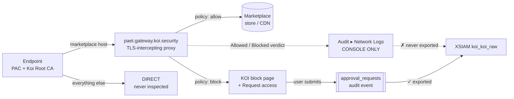

# KOI Supply Chain Gateway — operator guide

**Pack context:** built for the official **Marketplace KOI pack v1.2.3** (`demisto/content`
`Packs/Koi`, 13 commands, integration only) and its dataset `koi_koi_raw`. Content lives in
**KOI Content Extension v1.3.0**, which ships no integration of its own.

**Evidence:** every claim here is validated on tenant `paet` on **2026-07-23** by a real
end-to-end test. The raw evidence is `VERIFIED_FACTS.md` §9 — read that before changing anything.

---

## 1. What the gateway actually is

An **HTTPS-intercepting forward proxy** at `paet.gateway.koi.security`. A PAC file decides what
reaches it; everything not matched goes `DIRECT`. It is **not** an endpoint agent and **not** a
network tap — it only sees what the PAC routes to it.



**Covered by the PAC:** Chrome Web Store (+ `clients2.google.com`), Edge add-ons, Firefox
add-ons, VS Code marketplace (+ vsassets CDNs), Cursor, Windsurf, JetBrains, OpenVSX,
Hugging Face, `api.mcp.github.com`, Office add-ins, `storage.googleapis.com`.

**Not covered:** PyPI, npm, Homebrew, Chocolatey, Docker, OS software channels, sideloaded
installs. Those are governed — if at all — by KOI's separate **registry** approach (pip/npm
config), which is a different mechanism entirely.

---

## 2. The three things you must know before building anything

### 2.1 🚨 You cannot alert on a block

The gateway's own **Allowed/Blocked** verdict log (with domain, path, item ID, version, reason,
group, identity) lives in the console under **Audit → Network Logs** and is **never exported to
XSIAM**. `koi_koi_raw` has no gateway/block/network event type at all, and
`_raw_log contains "Blocked"` returns **0 rows**.

**Therefore:** every gateway detection in this pack targets the *consequences* of a block —
approval requests, remediations, and provenance gaps — never the block itself.

### 2.2 Enforcement happens at BOTH the store page and the package download

⚠️ **Corrected 2026-07-23.** An earlier version of this guide said enforcement was "at package
download, not browsing". That was wrong — it was inferred from one VS Code marketplace page loading
normally, when in fact that extension just wasn't blocked for that device.

Live-observed block points:
- **Store detail page** — `chromewebstore.google.com/detail/<slug>/<id>/should-request-access`.
  The gateway rewrites the URL with `/should-request-access`, which is how the block page offers the
  request flow.
- **Package download** — `clients2.googleusercontent.com/crx/blobs/…`.
- **Code-package registry** — `registry.npmjs.org/<pkg>`. This host is **not in the PAC**; it is
  enforced by Koi's separate **registry** integration (npm/pip config). Two independent paths.

On a blocked row, `Method`/`Status Code` are unavailable "because the request was blocked by the
gateway".

### 2.3 A blocked item is never in inventory

An approval request exists *because* the item was blocked → it was never installed → it is not
in inventory. `item_display_name=Snake` returns `total_count 0` on every marketplace while the
control returns 65 items. There is **no catalog/Koidex command** in the 13 Marketplace commands.

**Therefore:** you cannot "enrich the requested item". The inventory lookup is only meaningful
**inverted** — if the blocked item *is* present, that is the finding.

---

## 3. How to test the gateway

### 3.1 Confirm interception (30 seconds)

Browse to `https://marketplace.visualstudio.com/koi` on a PAC-configured host. KOI serves a
**"You Are Routing Through Koi!"** page in place of the real marketplace. If you get the real
Microsoft page, the PAC is not active; if you get a TLS error, the Koi Root CA is not trusted.

### 3.2 Trigger a real block → approval (must be done by a human)

1. Open the Chrome Web Store page for an extension your policy blocks.
2. Click **Add to Chrome** → **Add extension**.
3. The install fails and KOI presents a block page with **Request access**.
4. Submitting the form creates an `approval_requests` event, visible in
   **Operations → Requests** and exported to XSIAM.

**This leg cannot be automated from a browser tool.** The Chrome Web Store gallery cannot be
scripted or screenshotted by any extension, raw `.crx`/`.vsix` URLs are refused by agent safety
classifiers, and a page `fetch()` does not reproduce a real install (it never reaches the
gateway). Use a human, or an agent-enrolled endpoint.

### 3.3 Verify in XSIAM

```sql
dataset = koi_koi_raw
| filter type = "approval_requests"
| fields _time, object_name, marketplace, triggered_by, reason, message
| sort desc _time | limit 10
```

---

## 4. What this pack ships for the gateway

| Content | Where | What it does |
|---|---|---|
| `koi_approval_*` columns | `ParsingRules/KoiContentExtension` | Extracts decision / requester / decider / risk from the free-text `message`, because `action` is null on every approval row |
| **G1–G6** detections | `docs/xql/G*.xql`, `docs/DETECTION_QUERIES.md` | Approval pressure, re-request after rejection, no-provenance installs, system guardrails, rejected-then-installed, coverage gap |
| **KOI Ext - Gateway Approval Triage** | `Packs/…/Playbooks` | Evidence-backed recommendation for a reviewer; never approves |

### The one number to quote

Over 90 days on this tenant, **≈3,088 installs were outside PAC scope versus ≈230 inside** —
roughly **nine in ten** installs with a known marketplace never traverse the **PAC**. Say this
before anyone concludes "the PAC will stop supply-chain installs".

**But do not present that as unprotected surface.** For npm and PyPI, KOI does policy-based
prevention **at install time** "as long as the Koi Proxy is configured" — and **without the endpoint
script**. The gap is a **PAC delivery** limit, not a capability limit: a PAC is a browser/OS-proxy
mechanism and `npm`/`pip` do not read it, which is why KOI's docs say to deploy registry config when
*"You use a PAC file integration and CLI tools (pip, npm) do not inherit proxy settings"*. Adding the
registry hosts to the PAC would not help.

Three documented script-free routes to govern npm/PyPI:
1. **SWG layer** — route the registry hosts to KOI at the gateway/SASE tier. KOI: *"This handles
   routing and trust automatically without per-tool configuration."* A Prisma Access / Zscaler /
   Netskope customer already has this tier.
2. **Repository manager** — configure KOI as an **upstream registry** on Artifactory / Nexus.
3. **Per-endpoint** `.npmrc` / `pip.conf` pushed by MDM.

Live proof via route 3 on this tenant: `Blocked · NPM · registry.npmjs.org /lodash-es`.

⚠️ **The code-package path needs no Koi Root CA.** *"Koi serves TLS from a certificate signed by a
globally recognized Root CA. No additional trust configuration is required."* KOI acts as a registry
endpoint there, not a TLS interceptor — so the CA deployment conversation applies to the
**marketplace** path only.

---

## 5. Two traps that will bite you

**The requester email is a claim, not an identity.** On endpoints with the PAC + CA but no KOI
agent, the gateway cannot attribute the user — the request URL literally carries
`user_id=unknown&requestedBy=unknown` — so the end user **types their own email**. A live row in
this tenant reads `amahmoud@paltoaltonetworks.com`, a typo of the real domain. Never gate an
approval on it; `triggered_by` is the structured actor field.

**Approval rows carry no item ID.** `object_id` is the *request's* UUID, not the extension's.
Correlating an approval to an install is **name-based**, and `item_display_name` is a
case-insensitive **substring** match — a short or generic name can over-match.

---

## 6. Parsing-rule columns are ingest-time only

The `koi_approval_*` columns are populated by the parsing rule **as events arrive**. They are
**null on every historical row**. Every query in Theme G therefore re-derives them **inline**, so
it works across all history. Keep the inline expressions and the `.xif` in sync when either
changes.
