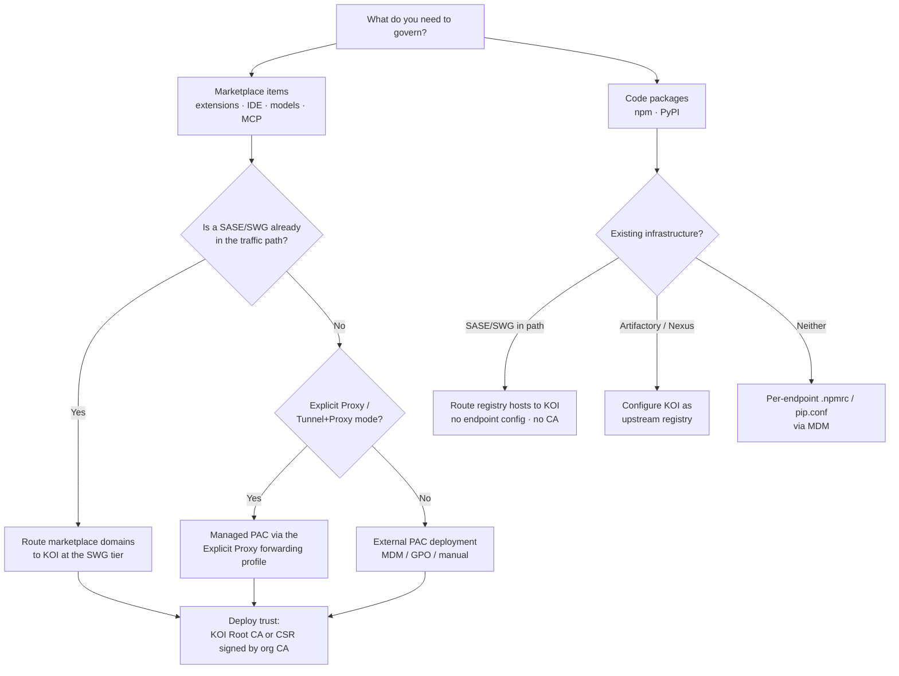

# KOI Supply Chain Gateway — network integration guide

How to route software-supply-chain traffic into KOI through a firewall, proxy or SASE tier, what
each deployment scenario actually gives you, how user-identity forwarding works, and how to prove
the whole thing is working.

Written against the KOI product documentation and validated by hands-on testing of a live gateway.
Where a statement comes from observed behaviour rather than the vendor docs, it says so. Where a
question is genuinely open, it is listed as open rather than guessed.

**Scope note.** This is a *network integration* guide. It does not cover endpoint script package
deployment (MDM/EDR), agentic runtime control, or the XSOAR/XSIAM content built elsewhere in this
repository.

---

## 1. What the gateway is

The Supply Chain Gateway is an **HTTPS-intercepting forward proxy**. Clients are pointed at it, it
terminates TLS for a defined set of software-distribution hosts, evaluates each request against
policy, and then allows, blocks, or serves a page offering the user a way to request an exception.

Two properties drive every design decision below:

1. **It only sees what you route to it.** It is not a tap and not an agent. A host you do not route
   is a host it cannot govern.
2. **It enforces inline, before the software lands.** This is what distinguishes it from the endpoint
   script package, which detects and remediates *after* an install.

### 1.1 Two enforcement paths, with different requirements

This is the single most misunderstood part of the product. There are **two** independent paths, and
they differ in routing mechanism *and* in trust requirements.

| | **Marketplace path** | **Code-package path** |
|---|---|---|
| Covers | Browser extension stores, IDE marketplaces, model hubs, MCP registries, Office add-ins | npm, PyPI |
| Routing | PAC file **or** SWG/SASE routing | Registry redirect **or** SWG/SASE routing **or** repo-manager upstream |
| TLS role | KOI **intercepts** — presents its own certificate | KOI acts as a **registry endpoint** |
| Trust requirement | **KOI Root CA must be trusted** (or KOI's CSR signed by your org CA) | **None** — KOI serves a certificate signed by a globally recognised Root CA |
| Endpoint script required | No | No |

> Vendor doc, code-package path: *"Koi serves TLS from a certificate signed by a globally recognized
> Root CA. No additional trust configuration is required."*

**Practical consequence:** the certificate conversation applies to the **marketplace path only**. A
team that only wants npm/PyPI governance does not need to deploy a CA anywhere.

---

## 2. Deployment scenarios

The vendor's integration overview splits capability three ways — script package, network
integration, and both. Condensed to what matters operationally:

| Capability | Script only | Network only | Both |
|---|---|---|---|
| Item discovery & inventory | ✅ | ✅ | ✅ |
| Risk assessment / item risk report | ✅ | ✅ | ✅ |
| **Block an install before it lands** | ❌ | ✅ | ✅ |
| Guardrails | Detection / Remediation | **Prevention** | ✅ |
| Policies | Alert / Alert-and-Remediate | **Allow / Block** | ✅ |
| **Endpoint inventory** | ✅ | ❌ | ✅ |
| **Manual remediation, provisioning, commands** | ✅ | ❌ | ✅ |
| Audit log / API | ✅ | ✅ | ✅ |

### 2.1 How to read that table

- **Network only** is the *prevention* tier. It is the only way to stop an install at the moment it
  happens. It gives you no endpoint inventory and no ability to remove something already installed.
- **Script only** is the *detection and cleanup* tier. It sees what is on the machine and can remove
  it, but it cannot prevent the install.
- They are complementary, not alternatives. The script catches what the network tier cannot see
  (sideloaded software, installs from a network path you did not route, machines off the corporate
  path); the network tier stops what the script could only clean up afterwards.

### 2.2 What the script does *not* add

Tested directly, comparing an enrolled endpoint against an endpoint with routing and trust only:

- **The script does not supply user or device identity to the gateway.** In every gateway log entry
  inspected — allowed and blocked, from both an enrolled and an unenrolled endpoint — the
  **`Identity` and `Group` fields were empty**.
- Consequently, **an exception request raised from the block page carries no device attribution**
  regardless of whether the script is installed.

This matters because it is counter-intuitive: people assume deploying the agent will "fill in the
user" on gateway events. It does not. See §5.

---

## 3. Choosing a routing method

### 3.1 ⚠️ A PAC file cannot govern npm or PyPI

A PAC file is a **browser / OS-proxy** mechanism. `npm` and `pip` do not read it. Adding
`registry.npmjs.org` or `pypi.org` to your PAC will therefore **not** work.

> Vendor doc — deploy registry configuration when *"You use a PAC file integration and CLI tools
> (pip, npm) do not inherit proxy settings."*

This is a **delivery** limitation, not a capability limitation. KOI supports policy-based prevention
of npm and PyPI packages **at install time**, "as long as the Koi Proxy is configured", and **without
the endpoint script**. You simply have to reach those tools by a route they cannot ignore:

1. **SWG / SASE tier** — *"If your organization already routes traffic through an SWG, you may be
   able to integrate Koi at that layer. This handles routing and trust automatically without
   per-tool configuration."* No endpoint config, no CA.
2. **Repository manager** — KOI as an **upstream registry** on Artifactory or Nexus. Avoids
   per-endpoint configuration entirely.
3. **Per-endpoint registry config** — `.npmrc` / `pip.conf` pushed by MDM. Use for CI runners,
   containers, or anywhere without SWG coverage.

> **Watch for override layers.** Package managers resolve their registry from several config
> locations, and settings closer to the project or process win. Project-level `.npmrc`, virtualenvs,
> conda, `nvm`, `pyenv` and repository-manager settings can all silently override a global registry
> and route around KOI. Audit these before declaring coverage.

### 3.2 Coverage reality check

Route only the marketplace domains via PAC and you may cover a **small minority of actual install
volume** — in one observed deployment, code packages and OS/software channels accounted for roughly
nine of every ten installs that had a known source, with browser/IDE marketplaces the remainder.

Say this out loud before anyone concludes "the gateway will stop supply-chain installs". It stops
what you route to it. Plan the code-package path deliberately rather than assuming the PAC covers it.

---

## 4. Firewall, proxy and SASE integration

### 4.1 Generic requirements (any firewall or SWG)

1. **Allow the PAC file URL.** If it is blocked or filtered, clients fail to load the PAC and
   **silently fall back to direct routing — bypassing KOI entirely with no error**. This is the most
   dangerous single misconfiguration because it fails open and looks fine.
2. **Explicitly allow the marketplace domains to the KOI proxy ports.** If web-filtering or
   URL-category rules block them, installs and updates fail even when routing is correct.
3. **Allow outbound to the KOI proxy FQDN on its full port range** (published in the deployment
   portal; a range, not a single port — the PAC selects a port dynamically per environment).
4. **Allow the HTTP `CONNECT` method to that port range.** Some proxy/application policies restrict
   which ports `CONNECT` may target even when host and port are otherwise permitted.
5. **Write rules against FQDN objects, not IP addresses.** Marketplaces and the KOI proxy are
   CDN-served; an IP-based rule works once and then silently breaks when the address rotates,
   producing intermittent, hard-to-diagnose failures.

### 4.2 Palo Alto specifics

- **App-ID coupling.** On firewalls that classify by application or URL category, a rule based on
  host and port alone may not match. Couple the rule to the relevant applications and categories —
  typically `http-proxy`, `web-browsing` and `ssl`, plus the Google-related categories used by the
  Chrome/Google marketplace domains.
- **Use FQDN objects** so the firewall periodically re-resolves each name and keeps allowing
  whatever addresses it currently points to.

### 4.3 Prisma Access

Integration is PAC-based, in one of two shapes depending on how GlobalProtect is configured.

**Prerequisites**
- Admin access to the Strata console with Explicit Proxy policies enabled.
- The marketplace domain list, proxy FQDN and port range from the KOI deployment portal.
- A trust decision (see §4.4).

**Option 1 — Managed PAC via Explicit Proxy**
Use when GlobalProtect runs in **Tunnel + Proxy** or **Proxy** mode.

1. Workflows → Prisma Access Setup → **Explicit Proxy** → **Forwarding Profiles Setup**.
2. Add or edit a forwarding profile and upload the KOI PAC file. Save, then **Push Config**.
3. Verify the profile is actually applied to endpoints: Workflows → Prisma Access Setup →
   **GlobalProtect** → **GlobalProtect App** → the relevant App Settings profile → **Show Advanced
   Options** → confirm Agent Settings mode is **Tunnel + Proxy** or **Proxy** → under **Proxy →
   Forwarding Profiles**, select the profile. Save and **Push Config**.

**Option 2 — External PAC deployment**
Use when GlobalProtect is Tunnel-only, or Explicit Proxy is not in use. Deploy the PAC by MDM, GPO
or manual configuration so marketplace domains route to the KOI proxy.

**Code packages under Prisma.** Neither option above reaches `npm`/`pip`, for the reason in §3.1.
If Prisma Access is in the traffic path, routing the registry hosts to KOI at that tier is the
route that needs no endpoint configuration and no certificate — see §3.1 option 1, and the open
question in §7.

### 4.4 Trust models (marketplace path only)

Two supported models. Pick based on what your SWG accepts.

| Model | How it works | Typical use |
|---|---|---|
| **Deploy the KOI Root CA** | Download the CA from the deployment portal (*Set up Network → Establish Network trust → Download CA*) and install it as a **Trusted Root CA** — on endpoints, and/or uploaded to the SWG | Simplest; the pattern used where the SWG can trust an uploaded CA |
| **CSR signed by your org Root CA** | KOI provides a CSR, your organisation's Root CA signs it. The SWG is then pointed at *your* CA as the proxy's root certificate | Where the SWG expects the upstream proxy's certificate to chain to a CA it already trusts |

Establish trust **before** configuring any route. If the route is live before trust exists, traffic
inspection fails and users see certificate errors.

---

## 5. User identity forwarding (`X-Authenticated-User`)

### 5.1 The problem it solves

The gateway sees traffic, not people. On an endpoint that has routing and trust but no endpoint
script, KOI cannot attribute a request to a user. Observed behaviour:

- The block page's request-access URL carries **`user_id=unknown`** and **`requestedBy=unknown`**.
- The exception-request form's **"Requested by"** field is therefore **empty and typed by the end
  user** — an unverified, free-text claim. In testing, a submitted request contained a **misspelled
  corporate domain**, which no directory lookup could ever have produced.
- The gateway log's **`Identity` and `Group` columns were empty on every entry inspected**.

And per §2.2, **deploying the endpoint script does not fix this** — those fields stayed empty on
enrolled endpoints too.

### 5.2 What KOI supports

KOI's gateway **consumes the `X-Authenticated-User` (XAU) header** from an upstream proxy that has
already authenticated the user. This is documented for multiple secure web gateways, with these
settings:

| Platform | Documented directive |
|---|---|
| **Zscaler** | `Insert X-Authenticated-User`: **on** · `Enable Base64 Encoding for X-Authenticated-User value`: **off** · `Proxy's Root Certificate`: the org CA that signed the KOI CSR |
| **Netskope** | `Insert X-Authenticated-User header`: **Enabled** (within its *Proxy Chaining Integration* flow) |
| **Blue Coat** | A *Control Request Header* action setting `X-Authenticated-User` to the authenticated user ID, applied only when forwarding to KOI. Its guide also notes an **SSL interception rule is required "to insert identity headers"** |

**Two things to carry across to any platform:**
- **Send the value un-encoded.** Where the setting exists, Base64 encoding is explicitly turned
  **off** — KOI expects the plaintext identifier.
- **Scope the header to KOI-bound traffic**, not to all egress. The header carries user identity;
  do not leak it to arbitrary destinations.

### 5.3 Documentation gap

At the time of writing, the vendor's **Prisma Access guide contains no identity-header section** —
verified by an exhaustive sweep of the integration, network, policy and gateway documentation, in
which only the three platforms above matched. This is a **documentation gap rather than a product
gap**: the gateway already ingests the header; the Prisma page simply does not describe how to send
it. The Netskope *Proxy Chaining Integration* flow is the closest published template.

### 5.4 Design considerations

- **Transport.** With encoding disabled the header is plaintext identity. Prefer a TLS-protected hop
  between the proxies where the platform supports it.
- **Header insertion vs tunnelling.** A proxy that merely `CONNECT`-tunnels HTTPS cannot modify the
  inner request. Confirm on your platform whether the header is attached to the `CONNECT` itself or
  requires decryption — one vendor guide explicitly ties identity-header insertion to having SSL
  interception enabled.
- **Identity format.** Agree the format (UPN, `DOMAIN\user`, or email) with both sides. KOI has to
  match the value to a user or group for policy scoping and the approval workflow to be useful.
- **Trust the source.** Only accept or forward identity headers on connections between the two
  proxies. An identity header from an untrusted source is an impersonation primitive.

---

## 6. Validating the integration

A repeatable sequence, cheapest first. Each step has an explicit pass condition.

### Step 1 — Routing and trust (30 seconds)

From a configured endpoint, browse to the KOI connectivity path on any covered marketplace host
(the vendor publishes a `/koi` test path).

- **Pass:** KOI serves its own "routing through KOI" page in place of the real marketplace site,
  **with no certificate warning**. This proves three things at once: the route is active, the CA is
  trusted, and the gateway can substitute responses.
- **Real marketplace page instead** → routing is not active (PAC not loaded, or host not covered).
- **Certificate error** → trust is not established. Fix trust before anything else.

### Step 2 — Allow path

Browse a marketplace item that policy permits.

- **Pass:** the page loads normally, and a corresponding **Allowed** entry appears in the gateway
  network log with the marketplace identified as the source.

### Step 3 — Block path

Attempt to install an item that a policy blocks. Note that the block is enforced at **more than one
point** — observed enforcement includes:
- the **store item page** (the gateway rewrites the URL to a request-access path), and
- the **package download** host, and
- the **package-registry** host on the code-package path.

- **Pass:** the install fails and KOI presents its block page; a **Blocked** entry appears in the
  gateway network log carrying the item name, item ID and a reason.
- On a blocked entry, method and status code are unavailable by design — the request never reached
  the origin.

> **Automating this is harder than it looks.** Browser extension stores are protected pages that
> automation frameworks generally cannot script or screenshot, and driving raw package-download URLs
> is often restricted. The reliable ways to exercise a block are a **human clicking install**, or a
> **CLI package manager** on the code-package path (which scripts cleanly).

### Step 4 — Exception request path

From the block page, follow the request-access flow and submit a request.

- **Pass:** the request appears in the console's requests queue with the item, marketplace, risk
  level, requester and justification, and can be approved or rejected.
- **Check attribution here.** If the "Requested by" field arrived pre-filled, identity forwarding is
  working. If it was blank and the user typed it, it is not — see §5.

### Step 5 — Code-package path

With the registry route in place, attempt to install a package that policy blocks.

- **Pass:** the package manager fails to install it, and a **Blocked** entry appears in the gateway
  network log with the registry as the source and the package as the item.

### Step 6 — Identity verification

Open any gateway log entry and inspect the **`Identity`** and **`Group`** fields.

- **Populated** → identity forwarding is working end to end.
- **Empty** → no identity is reaching the gateway. Expected today unless an upstream proxy is
  inserting XAU; note again that the endpoint script does **not** populate these.

### Step 7 — Failure-mode check (do not skip)

Deliberately confirm the **fail-open** case: block the PAC URL at the firewall and retry Step 1. If
the endpoint silently reaches the real marketplace, you have reproduced the most important
misconfiguration in §4.1 — and you now know what it looks like from the console (silence).

---

## 7. Open questions to confirm with the vendor

Carry these into any deployment where identity or code-package coverage matters:

1. Is the **SWG-tier route supported for npm/PyPI** on a given SASE platform, and does it use the
   same proxy hosts and ports as the marketplace path?
2. Does the gateway read `X-Authenticated-User` from the **`CONNECT`** request, or only from a
   decrypted request?
3. Which **identity formats** does the gateway accept, and how does it map a value to a user or
   group?
4. Does a forwarded identity populate the gateway log's **`Identity` / `Group`** fields and pre-fill
   **"Requested by"** on an exception request?
5. Can **endpoint-group-scoped policies** apply to a network-only endpoint, and if so what supplies
   the group — source address, forwarded identity, or something else? (The vendor capability matrix
   marks device-group policies as available for network integration, which is difficult to reconcile
   with empty `Identity`/`Group` fields in practice. Worth clarifying explicitly.)

---

## 8. Known rough edges

Observed during testing; useful to recognise rather than debug from scratch.

- **PAC failure is silent and fails open.** Nothing in the console distinguishes "endpoint bypassed
  the gateway" from "endpoint installed nothing". Monitor for the *absence* of expected traffic.
- **A block reason string may name the wrong item type.** A blocked code package was reported with a
  reason phrased in terms of extensions. Cosmetic, but confusing in reports.
- **The gateway's per-request verdict log may not be exported.** Confirm whether Allowed/Blocked
  network-log entries reach your SIEM, or whether only the audit/approval/remediation event stream
  does. Design detections against the stream you actually receive rather than what the console
  displays.
- **PAC files are tenant-scoped.** The identifier embedded in the PAC URL identifies the deployment.
  Do not reuse a PAC across tenants, and treat the URL as environment-specific configuration.
