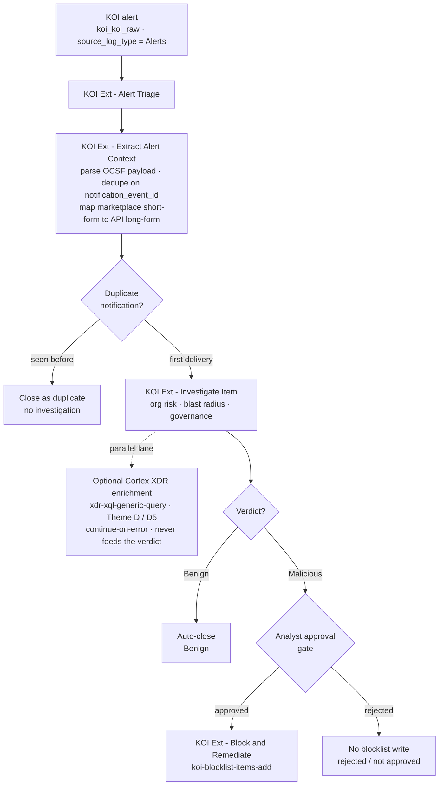
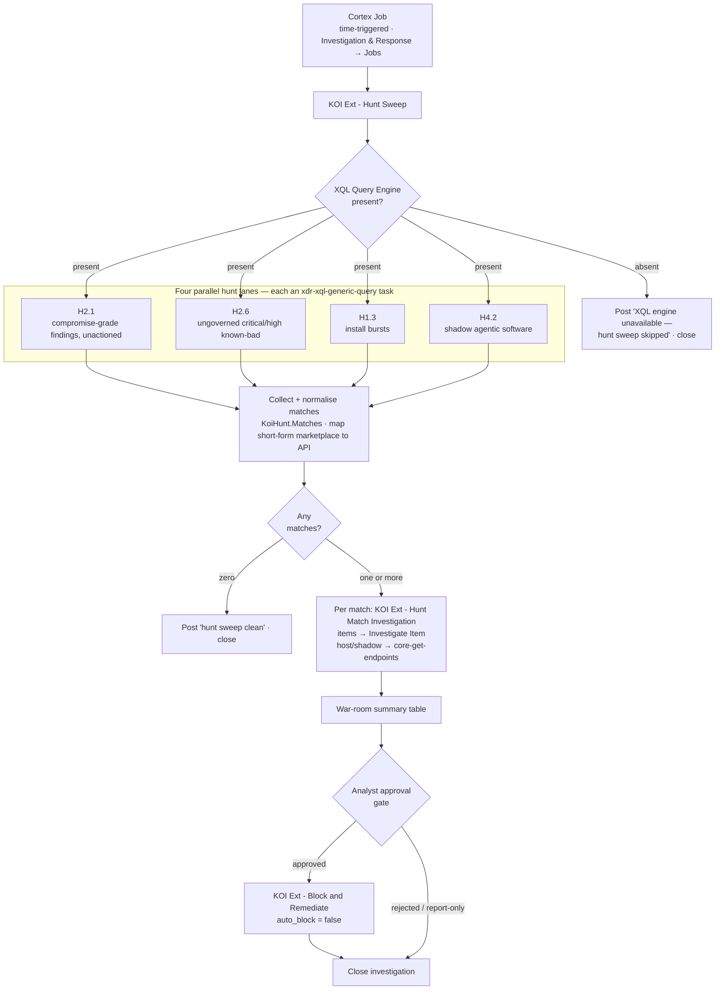

# Deployment & operations — KoiContentExtension companion pack

**Pack under description:** the **KoiContentExtension** companion pack, **v1.1.0**, community support.
It extends the installed **Marketplace KOI pack v1.2.3** (`demisto/content` `Packs/Koi` — 13
commands, integration only). The companion pack ships **no integration and no commands of its own**:
it normalizes and models the `koi_koi_raw` dataset the KOI integration produces, and drives
playbooks and a dashboard built strictly against that integration's 13 commands.

> ⚠️ **Which KOI pack.** A separate in-house **custom** KOI pack (v1.3.0, 26 commands) is also called
> KOI, also has integration id `KOI`, also is category `Endpoint`, and also uses `koi-*` commands.
> The two **cannot coexist on one tenant** — installing one overwrites the other. Everything here
> concerns the **Marketplace pack v1.2.3** and the extension built on top of it. See
> [`../SESSION_BRIEF.md`](../SESSION_BRIEF.md).

Every factual claim traces to [`../VERIFIED_FACTS.md`](../VERIFIED_FACTS.md) (the live-tenant
evidence base, verified on `api-ayman.xdr.eu`) or to the pack content on disk under
[`../Packs/KoiContentExtension/`](../Packs/KoiContentExtension/). Live figures carry their
measurement date — **21 July 2026** for every `koi_koi_raw` figure quoted below — because the
dataset grows on every fetch cycle and an undated figure is not reproducible.

**Related docs:** [solution architecture](./ARCHITECTURE.md) ·
[query-library operator guide](./QUERY_LIBRARY.md) · [detection queries](./DETECTION_QUERIES.md) ·
[hunting queries](./HUNTING_QUERIES.md) ·
[troubleshooting guide](./KOI_Marketplace_Pack_Troubleshooting_Guide_v1.0.pdf) ·
[repository overview](../README.md) · [pack README / caveats](../Packs/KoiContentExtension/README.md).

---

## 1. Prerequisites & install order

The order is not optional. The companion pack binds to a stream and a dataset it does not own, so
the thing it binds to has to exist first.

### 1.1 Install the KOI Marketplace pack first, and configure an instance

1. **Install the `Koi` pack (v1.2.3 or later)** from the marketplace.
2. **Configure and enable a KOI integration instance**, and confirm it is fetching events
   (`isFetchEvents: true`). On the validation tenant both instances point at
   `https://api.prod.koi.security/` and fetch `Alerts` + `Audit` into `koi_koi_raw`
   ([`../VERIFIED_FACTS.md`](../VERIFIED_FACTS.md) §2, §3).

   > The KOI event collector is **XSIAM / platform only**. The integration YAML sets
   > `isfetchevents: true` and overrides it on the next line with `isfetchevents:xsoar: false`, so on
   > an XSOAR tenant KOI is a command integration and nothing more, `koi_koi_raw` never fills, and
   > this pack's rules and dashboard have no data ([`../VERIFIED_FACTS.md`](../VERIFIED_FACTS.md) §2).

Without the KOI pack installed and an enabled instance fetching events, **every playbook fails at
its first command task and every dashboard widget is empty**
([`../Packs/KoiContentExtension/README.md`](../Packs/KoiContentExtension/README.md), "Prerequisite").

### 1.2 Then install KoiContentExtension

This pack **ships no integration by design.** An integration here would collide with the installed
KOI integration on `commonfields.id: KOI` and silently overwrite it, which is exactly the two-pack
trap. Shipping additive content that binds to the existing `(vendor="koi", product="koi")` stream
avoids the collision.

**Minimum server version: Cortex XSIAM 8.4.0** (`serverMinVersion` in
[`../Packs/KoiContentExtension/pack_metadata.json`](../Packs/KoiContentExtension/pack_metadata.json)).
The rules and dashboard are XSIAM-only content and cannot install below it; the playbooks carry
`fromversion: 6.10.0`, which is left correct rather than inflated because `serverMinVersion` is the
field that actually gates installation.

### 1.3 Dependencies

Declared in
[`../Packs/KoiContentExtension/pack_metadata.json`](../Packs/KoiContentExtension/pack_metadata.json):

| Pack | Mandatory? | Why it is needed |
|---|---|---|
| `Koi` (KOI) | **mandatory** | The integration, its 13 commands, and the `koi_koi_raw` dataset. **v1.2.3+** |
| `CommonScripts` | **mandatory** | `SetAndHandleEmpty`, `Set`, `Print`, `PrintErrorEntry`, `DeleteContext`, `GetErrorsFromEntry` |
| `FiltersAndTransformers` | **mandatory** | `ParseJSON`, `JsonToTable`, `SetIfEmpty`, `FormatTemplate`, `LastArrayElement` |
| `Core` | **mandatory** | `Cortex Core - IR` — `core-get-scripts`, `core-get-endpoints`, `core-script-run` (the three `Unified *` playbooks and the host branch of the hunt sweep) |
| `CortexXDR` | **optional** (`mandatory: false`) | The **Cortex XDR - XQL Query Engine** and its `xdr-xql-generic-query` command. Needed **only** for the best-effort XDR enrichment on three investigation playbooks and — in practice — for the hunt sweep, whose whole job is running XQL |

`CortexXDR` stays optional so the pack installs and every KOI-command playbook works with no XQL
engine present. On the Cortex **platform** the same `xdr-xql-generic-query` command ships in the
already-mandatory `Core` pack; on **marketplacev2** it is the standalone `CortexXDR` pack — which is
why `CortexXDR` is the id declared optional.

`KOI Ext - Unified Process Config Entry` sends mail with the generic `send-mail` command, provided
by whichever mail-sender integration you install (`Mail Sender (New)`, `Gmail`, `Microsoft Graph
Mail`, EWS, …) and selected per config entry. No mail pack is declared, because declaring one
arbitrarily would force an unwanted install.

### 1.4 The rules deploy together, and both apply at ingest only

**Two hard rules, both from the pack on disk
([`../Packs/KoiContentExtension/README.md`](../Packs/KoiContentExtension/README.md) caveats 1–2):**

- **Deploy the parsing rule and the modeling rule together.** The modeling rule's Alerts block reads
  columns that exist only because the parsing rule promoted them at ingest. Deployed alone, **12 of
  its 20 Alerts mappings resolve to null** — it will not error, it will map nulls. The Audit block is
  nearly standalone but still needs the parsing rule for the one `marketplace_api` mapping on
  `xdm.target.resource.sub_type`.
- **Parsing rules apply at ingestion, and historical rows are never reprocessed.** Every column the
  parsing rule promotes stays **null on all data ingested before install**, and modeling-rule
  mappings that depend on those columns are empty until fresh events arrive. **A scan must run and
  fresh events must land** before promoted columns, XDM mappings, and any consumer reading them show
  anything. This is expected, not a broken rule — wait for a fetch cycle, then re-check.

The dashboard is engineered around this ingest-only caveat (see §5): it reads the raw JSON inline,
so it renders against historical rows too.

---

## 2. What deploys

Everything below is under
[`../Packs/KoiContentExtension/`](../Packs/KoiContentExtension/); the release notes in
`ReleaseNotes/1_0_0.md` and `ReleaseNotes/1_1_0.md` list each item.

### 2.1 Ingest and model

- **Parsing rule — `KoiContentExtension`.**
  `[INGEST:vendor="koi", product="koi", target_dataset="koi_koi_raw", no_hit=keep]`. Promotes **31
  flat columns** out of the JSON-string `metadata` / `resources` / `observables` / `finding_info`
  blobs, by **coalesce-by-`.type`** rather than fixed array index (over 90 days `resources[0].type`
  is `item` on the 296 `extension` rows but `mcp` on the 842 `mcp_server` rows). It adds the two
  API-vocabulary marketplace columns (`item_marketplace_api`, `marketplace_api`), the dedupe key
  `koi_notification_id` (from `metadata.notification_event_id`), an empty-string guard on
  `alert_item_version`, and `koi_product_version` as a change detector.
- **Modeling rule — `KoiContentExtension`** (+ `KoiContentExtension_schema.json`).
  `[MODEL: dataset=koi_koi_raw]`, one block for `source_log_type = "Alerts"` and one for `"Audit"`,
  mapping the promoted + raw columns to the Cortex Data Model. Two fields are deliberately left
  **unmapped** with DO-NOT-RE-ADD comments: `xdm.alert.original_alert_id` (was a policy id, 3
  distinct values across 1,040 alerts) and `xdm.target.host.fqdn` (hostnames carry a dot on 0 of
  1,138 rows — bare names, not FQDNs).

### 2.2 The 12 playbooks

Grouped by role. Each is one line of purpose; the flows are drawn in §3 and §4.

**Alert-triage chain**

| Playbook | Purpose |
|---|---|
| `KOI Ext - Alert Triage` | Top-level entry point: build context, score four signals, reach a verdict, then auto-close (Benign) or hand off to an analyst-gated response |
| `KOI Ext - Extract Alert Context` | Sub-playbook: parse the alert's OCSF `finding_info` / `observables` / `resources` into the flat `KoiContext.*` object; publish `notification_id` for dedupe and both raw + API-safe marketplace |
| `KOI Ext - Investigate Item` | Sub-playbook: full investigation of one inventory item — org risk, endpoints/blast radius, allowlist/blocklist standing |
| `KOI Ext - Investigate Device` | Device posture as an inventory query filtered by `device_id` (there is no device API — item-centric by necessity) |
| `KOI Ext - Enrich Item` | Sub-playbook: lightweight reusable enrichment (inventory record + endpoints); a trimmed alternative to Investigate Item |

**Response**

| Playbook | Purpose |
|---|---|
| `KOI Ext - Block and Remediate` | Re-check the item, recover its `marketplace`, present an analyst approval gate, and — only on approval — add it to the org blocklist with `koi-blocklist-items-add` |

**Standalone audit**

| Playbook | Purpose |
|---|---|
| `KOI Ext - MCP Server Audit` | Standalone/scheduled audit of MCP servers in inventory (`koi-inventory-list view=mcp_servers`), reporting risky ones |

**Script Runner trio — additional content, calls no KOI command**

| Playbook | Purpose |
|---|---|
| `KOI Ext - Unified Script Runner` | Read a Script Runner configuration list and dispatch each entry |
| `KOI Ext - Unified Process Config Entry` | Sub-playbook: validate one config entry, run it, mail the result |
| `KOI Ext - Unified Execute Endpoint Script` | Sub-playbook: resolve script + target endpoints, run, poll for the result |

> The three `Unified *` playbooks are **additional content, not part of the Marketplace KOI pack.**
> They call **no KOI command at all** — only the Cortex-native `core-get-scripts`, `core-get-endpoints`
> and `core-script-run`. They are included because the workflow ports unchanged alongside KOI, not
> because KOI provides it ([`../VERIFIED_FACTS.md`](../VERIFIED_FACTS.md) §7a).

**Hunt**

| Playbook | Purpose |
|---|---|
| `KOI Ext - Hunt Sweep` | Job-attached, time-triggered proactive hunt: run a configurable set of validated hunting XQL queries, investigate every match, post a war-room table, and route confirmed ungoverned known-bad to an analyst-gated block |
| `KOI Ext - Hunt Match Investigation` | Sub-playbook of Hunt Sweep: normalize one hunt match and return its verdict, reusing Investigate Item for items and `core-get-endpoints` for host/shadow matches |

### 2.3 Dashboard

- **`KOI Content Extension - Alerts Dashboard`** — **53 widgets across 25 layout rows**, on a 30-day
  relative window, all querying `koi_koi_raw` directly (none reference `xdm.*`, so the dashboard does
  not require the modeling rule). See §5 for how to read it.

---

## 3. The investigation flow

A KOI alert lands in `koi_koi_raw` (`source_log_type = "Alerts"`) and, via your correlation rule,
drives `KOI Ext - Alert Triage`. Triage parses the alert, deduplicates, investigates the item (with
optional Cortex XDR enrichment), reaches a verdict, and either auto-closes a Benign alert or routes
a Malicious one to an **analyst-gated** `KOI Ext - Block and Remediate`. **The blocklist write is
reachable only through a human approval decision — never on an automatic edge**
([`../Packs/KoiContentExtension/Playbooks/playbook-KOI_Ext_-_Alert_Triage.yml`](../Packs/KoiContentExtension/Playbooks/playbook-KOI_Ext_-_Alert_Triage.yml),
[`playbook-KOI_Ext_-_Block_and_Remediate.yml`](../Packs/KoiContentExtension/Playbooks/playbook-KOI_Ext_-_Block_and_Remediate.yml)).

Reading the flow:

- **Extract Alert Context** flattens the alert's own OCSF payload into `KoiContext.*` and publishes
  `KoiContext.notification_id` from `metadata.notification_event_id`. It also maps the event's
  **short-form** marketplace (`software_windows`, `chrome`, `vsc`) to the API **long-form**
  (`windows`, `chrome_web_store`, `vscode`) — the mapping is load-bearing, because passing an event
  value straight to a command returns HTTP 400
  ([`../VERIFIED_FACTS.md`](../VERIFIED_FACTS.md) §7c, §7d.1).
- **Dedupe on `notification_event_id`.** An Alerts row is a *fetch*, not an alert: the integration
  re-sends every still-open alert on each 1-minute fetch cycle, so a single real alert can arrive
  hundreds of times (one `mcp_server` alert was re-delivered 408 times on live data). The triage
  duplicate gate closes a re-delivery without investigating. It **fails open** — a missing
  notification id triages the alert normally, so a first delivery is never wrongly closed.
- **Investigate Item** substitutes for the custom pack's `koi-koidex-risk-report`, which does not
  exist here: item risk comes only from the org's own inventory record (`koi-inventory-list`), plus
  the endpoints carrying it and its blocklist/allowlist standing. **An empty inventory result is
  INCONCLUSIVE, not "clean"** — the inventory index lags the event stream, so a freshly-alerted item
  routinely has no record yet ([`../VERIFIED_FACTS.md`](../VERIFIED_FACTS.md) §7d.3).
- **Optional Cortex XDR enrichment** runs one Theme D / D5 query through `xdr-xql-generic-query` in a
  parallel lane. It is `continueonerror` and **never feeds the verdict, the analyst gate, or the
  auto-close**; if the XQL engine is absent the lane simply degrades.
- **Verdict → response.** Benign auto-closes. Malicious opens the block gate **only when an
  `item_id` is present**, then runs `KOI Ext - Block and Remediate` with `auto_block` forced
  `false`. Inside that playbook the write to `koi-blocklist-items-add` sits behind a hard analyst
  approval decision — the blocklist write can never fire without explicit approval.

---

## 4. The scheduled hunt sweep

`KOI Ext - Hunt Sweep` runs the pack's proactive hunts **on a schedule**, investigates matches, and
posts a war-room summary. It is triggered by a **time-triggered Cortex Job, not by a correlation
rule** — the deliberate design for this pack. KOI is run-on-demand (there is no resident agent), so a
scheduled Job is the hunt scheduler, exactly as it is for `KOI Ext - Unified Script Runner`. Each run
opens its own investigation and closes it, so the Jobs list stays clean and there is one summary per
run.

The four hunt lanes (bodies embedded verbatim, parameterised only by `xql_time_frame`) come from
[`./HUNTING_QUERIES.md`](./HUNTING_QUERIES.md): **H2.1** items carrying compromise-grade KOI
findings deduped on `notification_event_id`; **H2.6** critical/high KOI known-bad not under
governance; **H1.3** install bursts; **H4.2** shadow agentic software (MCP / AI agent) executing in
`xdr_data` that KOI never inventoried. Matches normalise into a single `KoiHunt.Matches` array,
short-form marketplace mapped to API form before any `koi-*` command sees it. **Zero matches → "hunt
sweep clean" and close.** Otherwise each match is investigated (item matches via Investigate Item;
host/shadow matches via `core-get-endpoints`, which *recommends* — never runs — a `core-script-run`
of the KOI deployment script to refresh a stale host), the war-room table is posted, and a confirmed
known-bad, ungoverned item that meets `min_risk` is routed to `KOI Ext - Block and Remediate` with
**`auto_block=false`**. The gate is hard-wired: **a scheduled sweep never auto-blocks.**

### 4.1 Attach it to a Job

Mirror the way `KOI Ext - Unified Script Runner` is scheduled
([`../Packs/KoiContentExtension/README.md`](../Packs/KoiContentExtension/README.md), "Attach it to a
Job"):

1. **Settings → Investigation & Response → Jobs → New Job.**
2. Choose **Scheduled** (time-triggered) and set the cadence — every 12 or 24 hours, or a cron such
   as daily at 02:00. **Do not** attach a feed or a triggering incident type; this is a time
   trigger, not an event trigger.
3. Set the Job's **Playbook** to **`KOI Ext - Hunt Sweep`**.
4. (Optional) Override inputs on the Job — narrow `hunt_set`, lengthen `xql_time_frame`, or set
   `enable_response_gate=false` for a report-only cadence while you tune it.
5. Ensure the **Cortex XDR - XQL Query Engine** integration is enabled and the **KOI** integration
   instance is configured. Save and enable the Job.

### 4.2 Inputs and defaults

| Input | Default | Meaning |
|---|---|---|
| `hunt_set` | `H2.1,H2.6,H1.3,H4.2` | Which hunts run — a comma-separated set of hunt ids, or a List value (`${lists.<name>}`). Tune it **without editing the playbook** |
| `min_risk` | `high` | Minimum item risk eligible for the analyst-gated response route |
| `xql_time_frame` | `7 days` | Relative time frame for every hunt query |
| `auto_investigate` | `true` | `false` posts the raw matches and closes without investigating or routing |
| `max_matches_to_investigate` | `25` | Per-hunt fan-out cap so a scheduled sweep never runs unbounded (each hunt's XQL `limit` is a hard backstop) |
| `enable_response_gate` | `true` | `false` summarizes only; never routes to response |
| `instance_name` | — | KOI integration instance; empty uses the single configured one |

### 4.3 The XQL engine is effectively required for THIS playbook only

Its whole purpose is running XQL, so unlike the optional enrichment on the investigation playbooks,
`KOI Ext - Hunt Sweep` does nothing useful without `xdr-xql-generic-query`. It still **degrades
gracefully**: every XQL task is `continueonerror`, and if the engine is absent the playbook posts
*"XQL engine unavailable — hunt sweep skipped"* and closes. The pack as a whole does **not**
hard-depend on the engine — the `CortexXDR` dependency stays `mandatory: false` (§1.3); only this one
playbook needs it.

---

## 5. The dashboard

`KOI Content Extension - Alerts Dashboard` is **53 widgets across 25 layout rows** on a 30-day
relative window, covering alert volume, item and MCP-server risk, device posture, and marketplace
breakdown ([`../Packs/KoiContentExtension/XSIAMDashboards/KoiContentExtension_Alerts_Dashboard.json`](../Packs/KoiContentExtension/XSIAMDashboards/KoiContentExtension_Alerts_Dashboard.json)).
All 53 query `koi_koi_raw` directly; none reference `xdm.*`, so it does not depend on the modeling
rule.

Two caveats govern how to read it — both measured, both designed around
([`../Packs/KoiContentExtension/README.md`](../Packs/KoiContentExtension/README.md) caveats 1 and 8,
[`../VERIFIED_FACTS.md`](../VERIFIED_FACTS.md) §7e):

- **Widgets count distinct alerts, not rows.** Because an Alerts row is a fetch and not an alert,
  every counting or aggregating widget uses
  `count_distinct(json_extract_scalar(metadata, "$.notification_event_id"))`, and every row list
  collapses to one row per notification with an `ingested_copies` column. On a 24-hour window that is
  the difference between 734 rows and **3** real alerts. The anti-regression widget *Koi Alert Ingest
  Duplication (rows vs distinct alerts)* plots `ingested_rows` against `distinct_alerts` — the gap
  between the two series is re-sending, not alert volume, and it is where any reintroduced raw
  `count()` becomes visible.
- **Ingest-only: the dashboard reads raw JSON inline so it renders on historical data.** The dedupe
  key is always the **inline** `json_extract_scalar(metadata, "$.notification_event_id")`, never the
  promoted `koi_notification_id` column — parsing rules apply at ingest only, so the promoted column
  is null on every row ingested before this pack shipped, and a dashboard built on it would render
  empty. For the same reason every other promoted column it reads is `coalesce(<promoted>, <guarded
  raw read>)`. Of the 53 widgets, 25 never reference a promoted column and the other 28 re-derive
  every one they use inline, so **all 53 keep working after the parsing rule lands and on rows from
  before it**.

Two reading notes worth knowing so an empty chart is not misread:

- **Marketplace facets are labelled in the API vocabulary** (`marketplace_api` / `mcp_registry_api`),
  so a label an operator reads on a chart is a value they can paste into a `koi-*` command. Values
  with no API equivalent are labelled explicitly — `built_in` / `side_loaded` as
  *not-a-marketplace: <value>*, other unknowns as *unmapped: <value>* — rather than silently mixed in.
- **Item-resource widgets cover the `extension` cohort only** — 296 of 1,138 alert rows (26%,
  measured 21 July 2026), none since 2026-07-09, while current ingestion is effectively 100%
  `mcp_server`. Those widgets name the cohort in their title, so an empty item chart reads as "no
  extension alerts in-window", not "no risk". The MCP-by-registry chart likewise shows the blanks as
  an explicit *(none)* slice — the registry is the empty string on 705 of 716 MCP resources, and that
  blank is itself the signal (most MCP servers come from no registry).

---

## 6. Operational gotchas

These are the traps that produce a *wrong* answer rather than an error — the ones worth internalising
before you trust a result. Full detail and the endpoint-forensics carried forward from the custom-pack
investigation are in the
[**troubleshooting guide**](./KOI_Marketplace_Pack_Troubleshooting_Guide_v1.0.pdf)
(source: [`.docx`](./KOI_Marketplace_Pack_Troubleshooting_Guide_v1.0.docx)).

- **Run-on-demand scan — no scan, no events.** There is no resident KOI agent on Windows: no service,
  no process, no scheduled task. Events appear only after a scan runs, and the scan is driven through
  `core-script-run` of the KOI deployment script (the same name→uid→run path the Script Runner
  playbook uses). And KOI is **change-driven, not scan-driven** — a scan of an unchanged host produces
  no events at all; something must change. End-to-end, a scan completes and events are queryable in
  `koi_koi_raw` in roughly 4–10 minutes ([`../VERIFIED_FACTS.md`](../VERIFIED_FACTS.md) §7b, §7d).

- **Marketplace HTTP 400 — the event value was passed to a command unmapped.** The event and API
  `marketplace` vocabularies differ (short vs long form); only `npm` and `pypi` are spelled the same.
  On operator-generated data the mapping was necessary for **16 of 19 events (84%)** — only `pypi`
  would have worked untouched. If a command returns HTTP 400 on `marketplace`, a raw event value
  (`software_windows`, `chrome`, `vsc`, …) almost certainly reached it unmapped. `ollama`, `built_in`
  and `side_loaded` have **no** API equivalent and must be treated as "unknown marketplace", resolved
  from inventory instead ([`../VERIFIED_FACTS.md`](../VERIFIED_FACTS.md) §7c, §7d.1). The mapping is
  what [`./DETECTION_QUERIES.md`](./DETECTION_QUERIES.md) and [`./HUNTING_QUERIES.md`](./HUNTING_QUERIES.md)
  encode as a standing rule.

- **The SYSTEM-vs-user-profile detection path — a SYSTEM-profile install is invisible.** Detection
  follows the **user-profile PATH**, not the identity of the installing process. A `pip install`
  driven from the Cortex agent (a SYSTEM process) that lands in
  `C:\Windows\system32\config\systemprofile\…` is **never inventoried**; the same install into a user
  profile (`C:\Users\<user>\AppData\Roaming\Python\…`) is detected. So detection testing *can* be
  automated through the EDR agent — the only requirement is that the change land in a user-profile
  path, and that the item be verified absent from the host beforehand (KOI is change-driven, so a
  re-install of an already-inventoried item is a no-op)
  ([`../VERIFIED_FACTS.md`](../VERIFIED_FACTS.md) §7b, §7d.2).

- **Inventory lag — an empty inventory lookup is INCONCLUSIVE, not "not present".** Events and
  inventory are separate surfaces with different latency: items in the event stream were still absent
  from the inventory API 15 minutes later, and an unknown `(item_id, marketplace, version)` triple
  returns **HTTP 404**, not an empty 200. So the item a fresh alert is most likely about is exactly
  the one whose inventory lookup returns nothing — not because KOI does not know it, but because the
  index has not caught up. Every playbook here runs those lookups continue-on-error and no verdict
  asserts absence from an empty lookup; anything you build on top must do the same
  ([`../VERIFIED_FACTS.md`](../VERIFIED_FACTS.md) §7d.3).

For the endpoint file map (`C:\ProgramData\Koi\`), the mtime freshness proof, extension display-name
resolution, the dual registry-hive requirement, and the PowerShell stdin trap, see the
[troubleshooting guide](./KOI_Marketplace_Pack_Troubleshooting_Guide_v1.0.pdf) and
[`../VERIFIED_FACTS.md`](../VERIFIED_FACTS.md) §8.
