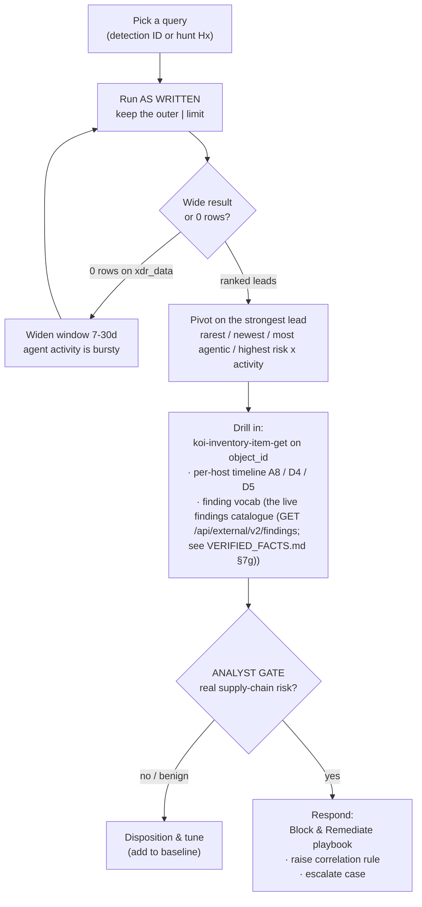

# KOI × Cortex XDR query library — operator guide

**Pack context.** This guide sits over the two XQL query libraries built for the official
**Marketplace KOI pack v1.2.3** (`demisto/content` `Packs/Koi` — 13 commands, integration only)
and its dataset **`koi_koi_raw`**, correlated with Cortex XDR endpoint telemetry **`xdr_data`**.
It is **not** the custom in-house KOI pack (v1.3.0, 26 commands). Everything here was validated on
tenant `api-ayman.xdr.eu`; the `koi_koi_raw` figures were re-validated **2026-07-22**.

This is the guide that makes the two libraries **usable**. It does not restate the queries — the
full bodies, per-query interpretation and false-positive notes live in the library files, and the
raw `.xql` bodies are in [`docs/xql/`](./xql/):

| Library | What it is | Count |
|---|---|---|
| [`DETECTION_QUERIES.md`](./DETECTION_QUERIES.md) | Signature-driven detection & investigation queries | **45** (A=8, B=12, C=13, D=12) |
| [`HUNTING_QUERIES.md`](./HUNTING_QUERIES.md) | Proactive, hypothesis-driven threat hunts | **26** (H1=7, H2=6, H3=7, H4=6) |

Every factual claim below traces to those two files,
[`VERIFIED_FACTS.md`](../VERIFIED_FACTS.md), or
[`reference/marketplace-pack.json`](../reference/marketplace-pack.json). Live figures carry the
2026-07-21/22 validation date.

---

## 1. Detection vs hunting — which library, and when

The two libraries answer different questions. Reach for the right one first.

| | **Detection & investigation** — [`DETECTION_QUERIES.md`](./DETECTION_QUERIES.md) | **Hunting** — [`HUNTING_QUERIES.md`](./HUNTING_QUERIES.md) |
|---|---|---|
| **Nature** | Signature-driven, item-parameterised | Proactive, hypothesis-driven, exploratory |
| **You already have** | A known item, host, or a fixed condition to test | A hypothesis and no signature |
| **It looks for** | A named package/repo/MCP server, or a fixed-threshold condition | Outliers, rare things, dangerous **combinations**, behavioural anomalies |
| **Output** | An answer / an alert-grade condition | A **ranked lead list** — never a verdict |
| **Backs** | A scheduled correlation rule, or a playbook enrichment step | An analyst hunt, or (for a hardened few) a scheduled sweep |
| **Themes** | **A** acquisition · **B** agentic runtime · **C** coverage/integrity · **D** investigation | **H1** composition anomalies · **H2** KOI risk-signal · **H3** runtime behaviour · **H4** cross-dataset |

A detection query says *"is this specific bad thing here?"* A hunt says *"what shape of bad thing
haven't we named yet?"* Where a hunt is adjacent to a detection query (H4.1 vs B8, H4.2 vs B9,
H3‑4 vs B5, H3‑6 vs B6), the hunt is the exploratory sibling — ranking, broadened scope, rarity, or
combination — and its differentiation is stated inline in the hunt.

---

## 2. The standing rules — read this before running anything

These four rules apply to **every** query in both libraries. They prevent the two most common
mistakes, either of which silently produces a wrong answer rather than an error. All four are
verified in [`VERIFIED_FACTS.md`](../VERIFIED_FACTS.md).

### 2.1 Alerts are duplicated ~245× — always dedupe; Audit is not

`koi_koi_raw` carries two `source_log_type` streams and they behave differently:

- **`Alerts`** (OCSF-shaped) — the integration re-sends **every still-open alert on each 1-minute
  fetch cycle**, so each real alert appears **~245× per 24h**. Any query over `Alerts` **must**
  dedupe on the notification event id and never `count()` raw rows:

  ```sql
  | alter nid = json_extract_scalar(metadata, "$.notification_event_id")
  | dedup nid by desc _time
  ```

  In validation, **734 raw Alerts rows collapsed to 3 real alerts**. Get this wrong and every
  figure is inflated two orders of magnitude. Dedupe on `notification_event_id` — **not** `_id`,
  and **not** `finding_info.uid` (that is the *policy* id, not an alert id).

- **`Audit`** (flat) — **not duplicated (1.0 ratio)**. `count()` is safe. Most detection queries use
  Audit for exactly this reason. Prefer it whenever you can.

### 2.2 Marketplace vocabulary differs between events and the API

The same thing has **two spellings**. Events (in `koi_koi_raw`) use short forms; the KOI API and the
`koi-*` commands use long forms:

| Event (query on this) | API / command spelling |
|---|---|
| `chrome`, `edge` | `chrome_web_store`, `edge_add_ons` |
| `vsc` | `vscode` |
| `software_windows` | `windows` |
| `github` | `github_mcp_registry` |
| `npm`, `pypi` | *(these two match)* |

Query the **event** (short) spelling in XQL; use the long spelling only when calling a command.
The `platform` field is **richer than `marketplace`** for agentic items (`claude_code`, `cur`,
`git`, `talon`, `homebrew`) — prefer `platform` for agentic pivots.

### 2.3 `dns_query_name` is empty on this tenant

`dns_query_name` is **0% populated**; `action_external_hostname` is only ~56% populated. **Do not
build any detection that requires a DNS name.** Egress queries fall back to `action_remote_ip`, and
`dest = coalesce(action_external_hostname, action_remote_ip)`.

### 2.4 CU discipline — cheap KOI, expensive XDR

- **`koi_koi_raw` is small** (~20k Audit rows/90d) — cheap and safe to run at **90d**.
- **`xdr_data` is expensive** (~1.27M rows/24h) — always keep the outer `| limit`, validate over a
  **narrow window (1–6h)**, then widen once. A poller timeout **with a `query_id` issued** is
  parse-confirmation, not failure — do not burn CU re-running it.
- **Agent/MCP activity is bursty:** `node` returns **0 over 24h but 288 over 7d**. Run agentic-runtime
  `xdr_data` queries over **7d**, never 24h, or you will call a clean-posture result a broken query.

**XQL gotchas that bite both libraries** (all verified): arithmetic must use `multiply()` / `add()`
/ `subtract()` — the `a*b` operator is a parse error here. `action_country` is an ENUM — cast with
`to_string()`, which yields the **ISO alpha-2 code** (`"US"`), not the label. `NT AUTHORITY\SYSTEM`
cannot be matched with an `in` list (XQL will not unescape the backslash) — use an anchored suffix
regex. Backslashes are unsafe inside XQL string literals — match Windows paths with separator-free
tokens (`contains "appdata"` … `contains "koi"`).

---

## 3. How to run a query — start broad, then pivot

The method is the same whether you are hunting or investigating: **run it as written, read the
shape, then pivot on the strongest lead.** A hunt returns a ranked lead list, not an alert — do not
expect a verdict from the first run.



The **analyst gate is a hard decision node — never an automatic edge.** No query in either library
fires an autonomous block; a human dispositions the lead before any response.

Three ways to actually run one:

1. **XSIAM XQL UI (interactive).** Paste the body from the library file or from
   [`docs/xql/<id>.xql`](./xql/). Best for the start-broad-then-pivot loop and for eyeballing a
   heavy join's `exec_pkg` / token columns before trusting a zero result.
2. **In a playbook** via `xdr-xql-generic-query`. This is how the KOI Content Extension
   investigation playbooks call the Theme **D** queries — each D query names its `// PARAM:` inputs
   (item token, hostname, alert time) for exactly this binding.
3. **Read-only from a script.** [`scripts/koi_tenant.py`](../scripts/koi_tenant.py) is the
   XSIAM/XQL client (paired with `koi_api.py` for the KOI vendor API). Read-only — safe for
   scheduled sweeps and for reproducing any validated figure.

---

## 4. By use case — what each theme answers, and the crown jewels

Reference query IDs; the bodies are in the library files. **Crown jewels** are the cross-dataset
KOI×XDR queries (neither product can produce the row alone) and the finding-combination hunts.

### Detection & investigation ([`DETECTION_QUERIES.md`](./DETECTION_QUERIES.md))

| Theme | Answers | Key IDs | Crown jewels |
|---|---|---|---|
| **A — Acquisition** | How did an item arrive? Which process/user/parent brought it, and did KOI see it? | A1 provenance · A2 non-interactive install · A4 drop-and-run | **A3** git clone × KOI GitHub inventory (recovers the commit SHA) · **A5/A6** bidirectional KOI↔XDR coverage gaps · **A7** KOI scan freshness from XDR alone · **A8** one-item acquisition timeline |
| **B — Agentic runtime** | What AI agents / MCP servers are actually executing, their egress, and which KOI-flagged risk is live? | B0/B1 inventory · B2 MCP stdio spawn · B4 egress profile · B5 anomalous egress · B6 credential-store access · B7/B12 KOI-side MCP inventory | **B8** KOI-scored risk observed executing · **B9** shadow MCP (running, never inventoried) · **B10** agent-driven installs |
| **C — Coverage & integrity** | Is the supply-chain telemetry even trustworthy? When did KOI last scan? | C1/C2 signature discovery · C3 scan executions · C6/C7 host population · C8/C9 coverage headline | **C4** KOI last-scan-age per host (the query that makes A5/A6 trustworthy) · **C10** negative result: `ProgramData\Koi` writes are invisible |
| **D — Investigation (playbook)** | Parameterised drill-downs for the KOI Ext playbooks | D1/D1b item history · D3/D3b/D3c device posture · D6 blast radius · D7 MCP alerts (deduped) · D9 version drift | **D2** XDR runtime evidence for a KOI item · **D4** host acquisition timeline (2 lanes) · **D5** alert-in-context (3 lanes) |

### Hunting ([`HUNTING_QUERIES.md`](./HUNTING_QUERIES.md)) — ranked best-first

| Theme | Hypothesis it tests | Key IDs | Crown jewels |
|---|---|---|---|
| **H2 — KOI risk-signal** | Known-bad that KOI already scored but nobody triaged; dangerous finding **combinations** | H2.1 compromise-grade unactioned · H2.3 exfil on agentic platforms · H2.4 MCP tool-shadowing shape · H2.6 known-bad ungoverned | **H2.1** (real hits: ModHeader→MaliciousActivity, SBlock→Spyware) · **H2.2** dangerous finding combinations (steal-and-ship / burned-secret chains) · **H2.5** compromise blast radius |
| **H4 — Cross-dataset** | KOI's verdict fused with XDR runtime reality | H4.3 agent-driven install escalated by KOI verdict · H4.4 scan-integrity anomaly · H4.5 network finding × observed egress | **H4.1** KOI risk × runtime activity (ranked, no threshold) · **H4.2** shadow agentic software · **H4.6** which dual-covered host to hunt first |
| **H3 — Runtime behaviour** | Agentic risk that leaves **no** KOI signature | H3‑1 agent→shell · H3‑2 lifecycle-hook abuse · H3‑5 LOLBin in agent context · H3‑6 credential read by bare runtime · H3‑7 native-module sideloading | **H3‑4** agent egress to estate-rare destinations (data-driven rarity — the rogue-MCP-phoning-home shape) |
| **H1 — Composition anomalies** | The *shape* of a supply-chain problem from Audit alone (cheap, no finding needed) | H1.1 org-wide rare items · H1.2 fast propagation · H1.3 install bursts · H1.4 npm scope confusion · H1.5 version rollback · H1.6 remediation that didn't stick · H1.7 publisher anomalies | *Lead generators — lower single-field signal; highest value combined with recency + agentic platform* |

---

## 5. From query to control — schedules, rules, and the analyst gate

Not every query is meant to run the same way. Some detections harden into **scheduled correlation
rules**; a hardened few hunts already run **on a schedule** inside the Hunt Sweep playbook; the rest
stay **analyst-run**. Operational cadence, ownership and the response wiring live in the operations
runbook — **[`OPERATIONS.md`](./OPERATIONS.md)** — this section is the query-side view of it.

### 5.1 Detections worth turning into scheduled correlation rules

Best candidates are the validated, low-false-positive **detection**-purpose queries whose condition
is stable:

| Query | Why it makes a good rule | Caveat |
|---|---|---|
| **A2** — non-interactive acquisition | The same `pip install` is benign from a shell, suspicious from a service/EDR payload | Allow-list your provisioning agent by image **and** command-line shape |
| **A4** — drop-and-run | Installer/archive/script written to a user path then executed from it | Windows servicing self-extraction is suppressed in-query; keep that filter |
| **A5** — KOI→XDR coverage gap | Items that arrived with no package-manager process (browser/IDE extensions) | Exclude the first scan per host; pair with A7 |
| **A7 / C4** — KOI scan freshness | Fires when `minutes_since_last_scan` exceeds tolerance — a pure coverage-assurance rule | Windows-only signature (bundled WinPython path) |
| **B5** — anomalous agent egress | Agent-owned process to an unapproved country or non-web port | CDN/anycast geo drives FPs — allow-list vendor domains, not countries |
| **B8 / B9** — KOI-scored risk executing / shadow MCP | The highest-value detections in the set | Heavy joins — schedule over a **narrow window**; eyeball `exec_pkg` before alerting |
| **C9** — coverage KPI | Single-number KOI-vs-Cortex host coverage for a dashboard | Shared SaaS tenant inflates the KOI host count |

### 5.2 Hunts the Hunt Sweep playbook already runs on a schedule

The KOI Content Extension **Hunt Sweep** playbook runs four hardened hunts automatically and routes
hits to **Hunt Match Investigation**:

- **H2.1** — compromise-grade findings present but unactioned (the sharpest known-bad signal)
- **H2.6** — critical/high known-bad with no remediation and no block (the governance gap)
- **H1.3** — install bursts (mass deployment / worm-like push in a tight window)
- **H4.2** — shadow agentic software (MCP server / AI agent running that KOI never inventoried)

### 5.3 Analyst-run hunts

Everything else is **analyst-driven**, run ad hoc during a hunt campaign or when a lead points at
it: the rest of **H1** (H1.1, H1.2, H1.4, H1.5, H1.6, H1.7), the composition/combination hunts
**H2.2 / H2.3 / H2.4 / H2.5**, all behavioural **H3** hunts (H3‑1…H3‑7), and the ranking/triage
cross-dataset hunts **H4.1 / H4.3 / H4.4 / H4.5 / H4.6**. Run **H4.6 first** in any campaign — it
ranks which dual-covered host to hunt on before you spend budget on the others. Several ship
`not-run` or `parse-confirmed` (H2.2, H2.3, H4.1, H1.2, H4.3) — validate over a narrow window before
promoting any of them to a schedule.

---

## 6. The finding vocabulary — how hunts pivot

The Theme **H2** and **H4** hunts pivot on KOI's **own** finding vocabulary: the real **167-entry (VERIFIED_FACTS.md §7g)
KOI findings catalogue** of risk-ranked `finding_id` values. Two ways to reach them:

- **In alert rows** — inside an Alert's item resource at
  `resources[type=item].data.findings.findings[].finding_id`. The detection library never extracts
  `data.findings`; this extraction is the finding-combination crown-jewel class (H2.1/H2.2/H2.3).
  The catalogue used by the hunts is pinned in `the live findings catalogue (GET /api/external/v2/findings; see VERIFIED_FACTS.md §7g)`.
- **Via the KOI API** — `POST /api/external/v2/inventory/search` with
  `{field:"finding_id", operator:"=", value:"<id>"}`. **This is the only source for MCP tool-integrity
  findings** (`ToolShadowing`, `ToolDescriptionMismatch`, `ToolPoisoning`, `UnauthenticatedMcpServer`):
  verified that `mcp`-kind alert resources carry an **empty** `data.findings.findings` array in
  `koi_koi_raw`, so those must come from the API, not XQL (see H2.4).

Finding ids come in two forms — **stable string ids** (`Typosquatting`) and **UUIDs**
(`d0a50fdc-…` = Malicious Activity Detected). The crown-jewel ids the hunts key on:

| finding_id | Meaning | Risk | Used by |
|---|---|---|---|
| `AssociatedwithMaliciousCampaign` | Tied to a known malicious campaign | 10 | H2.1, H2.2, H2.5 |
| `d0a50fdc-62f7-4b94-bb1a-600fec5959bc` | **Malicious Activity Detected** | 10 | H2.1, H2.2, H2.5 |
| `ExfilsCloudandRemoteAccessSecrets` | Exfiltrates cloud / remote-access secrets | 10 | H2.1, H2.2, H2.3 |
| `RansomwareBehaviorDetected` | Ransomware behaviour | 10 | H2.1, H2.2 |
| `SpywareActivity` | Spyware | 10 | H2.1, H2.2 |
| `ExfilsAIChatConversations` | Exfiltrates AI-chat conversations | 9 | H2.1, H2.2, H2.3 |
| `PromptInjectionDetected` | Prompt injection | 9 | H2.1 |
| `HighRiskManifestConfusion` | Manifest confusion | 9 | H2.1 |
| `Typosquatting` | Typosquat | 9 | H2.1 |
| `6d27a73d-460f-42f4-a53e-ce1630d6492f` | Malicious item by threat signal | 8 | H2.2, H2.5 |
| `PublisherCompromised` | Publisher compromised | 8 | H2.5 |
| `DataExportCapability` | Can export data (capability, not verdict) | 4 | H2.2, H2.3 |

Capability **families** (H2.2 combines ≥2 of these into a story a single finding never tells):
exfil (`Exfils*`, `DataExportCapability`), secret (`a80added-…`, `724e7816-…`), code-exec
(`CodeExecutionPermissions`, `ArbitraryCodeExecution`, `RemoteCodeExecution`, `ShellCommandExecution`,
`LlmDerivedCommandExecution`, `PowerShellCommandExecution`), network (`UnrestrictedNetworkAccess`,
`BypassesNetworkControl`, `InterceptsNetworkTraffic`, `DynamicNetworkDestination`,
`NetworkInterceptionPermissions`, `ExposesNetworkPort`), persistence
(`ImplementsPersistenceMechanism`, `RegistryEdit`), spyware (`ScreenCaptureActivityDetected`,
`ClipboardAccess`, `PerformsIPFingerprinting`).

`risk_level = pending` means KOI has **not finished scoring** — it does **not** mean safe. Pivot from
a finding to context with `koi-inventory-item-get` on the `item_id`, or to a per-host timeline with
detection **A8 / D4 / D5**.

---

## See also

- [`DETECTION_QUERIES.md`](./DETECTION_QUERIES.md) · [`HUNTING_QUERIES.md`](./HUNTING_QUERIES.md) · [`docs/xql/`](./xql/) — the query bodies
- [`OPERATIONS.md`](./OPERATIONS.md) — operational cadence, ownership and response wiring
- [`VERIFIED_FACTS.md`](../VERIFIED_FACTS.md) — the evidence base for every claim here
- [`reference/marketplace-pack.json`](../reference/marketplace-pack.json) — the 13-command surface
- [KOI Marketplace Pack Customer Guide v1.2.3](./KOI_Marketplace_Pack_Customer_Guide_v1.2.3.pdf) · [Troubleshooting Guide v1.0](./KOI_Marketplace_Pack_Troubleshooting_Guide_v1.0.pdf)
